# H1 Oma Linux

Ensimmäisenä tehtävänä oli tehdä lyhyet tiivistelmät ranskalaisin viivoin artikkeleista raportin kirjoittaminen sekä Free Software Definition. Toisena tehtävänä oli asentaa virtuaalikoneohjelmisto, jonka avulla luotiin uusi virtuaalikone. Tähän virtuaalikoneeseen tuli asentaa Linux. (Karvinen 2024.)

## Tiivistelmät

### Raportin kirjoittaminen

-Raportissa kerrotaan tarkasti mitä on tehty ja mitä toiminnasta seurasi.

-Hyvä raportti on toistettava, eli lopputuloksen tulisi olla sama, jos se toistetaan samalla tavalla uudelleen samalla laitteella.

-Raportin tulisi olla myös täsmällinen, joka tarkoittaa että, raportissa tulisi ilmoittaa tarkkaan niin kellonajat kuin mahdolliset virheet imperfektissä.

-Raportin on hyvä olla helppolukuinen, eli sen teossa tulisi käyttää virheetöntä kieltä ja kirjoittaa sivustolle sopivalla tyylillä.

-Lähteisiin viittaminen on myös tärkeää raporteissa, ja ne osoittavatkin että raportin tekijä on tutustunut raportin aiheeseen.

-Raportissa ei saa valehdella tekemistään testeistä ja tuloksista, plagioida toisten tekstejä tai käyttää muiden kuvia luvattomasti.

(Karvinen 04.06.2006.)

### Free Software Definition

-"Free Software"-määritelmällä tarkoitetaan vapaasti suomennettuna vapaata ohjelmistoa, eikä niinkään ilmaista ohjelmistoa.

-Vapaan ohjelmiston määritelmä pohjautuu siihen, että kaikilla käyttäjillä tulisi olla oikeus toistaa, kopioida, jakaa, tutkia, muuttaa ja parantaa ohjelmistoa.

-Vapaudet ovat jaettu neljään kategoriaan, jotka ovat vapaus 0, vapaus 1, vapaus 2 ja vapaus 3.

-Vapaus 0 on käyttäjän oikeus käyttää ohjelmistoaan haluamaansa tarkoitukseen, ja tämä sisältää myös vapauden olla käyttämättä ohjelmistoa ollenkaan.

-Vapaus 1 on käyttäjän oikeus tutkia lähdekoodia sekä muokata sitä.

-Vapaus 2 on käyttäjän oikeus jakaa alkuperäinen ohjelmisto eteenpäin.

-Vapaus 3 on käyttäjän oikeus jakaa muokkaamansa versio ohjelmistosta eteenpäin.

-Vapaassa ohjelmistossa kaikkien vapauksien tulee täyttyä, ja yksikin puute estää ohjelmiston määrittelyn vapaaksi ohjelmistoksi. 

-Avoimen lähdekoodin ohjelmistoja ei tule sekoittaa vapaisiin ohjelmistoihin, vaikka monet avoimen lähdekoodin ohjelmistot kuuluvatkin vapaan ohjelmiston määritelmään.

(GNU Operating System s.a.)

## Linuxin asentaminen virtuaalitietokoneeseen

Aloitin tehtävän tekemisen 21:40 illalla. En ollut aikaisemmin luonut virtuaalitietokoneita ja minulla ei ollut tarvittavia ohjelmia valmiiksi, joten aikalailla nollasta lähdettiin liikenteeseen.

### Käyttöympäristö

Tietokone: Itse kasattu pöytätietokone

Emolevy: PRIME Z390-P

Prosessori: 3,70 GHz Intel Core i5-9600k

Keskusmuisti: 16 GB 3200MHz DDR4

Näytönohjain: Radeon RX 5600 XT Pulse 6GB GDDR6

Tallennustilat: C:/ 500 GB SSD M.2, D:/ 1000 GB SSD M.2

Virtalähde: Corsair 650 W ATX-virtalähde

Käyttöjärjestelmä: Windows 11 Home

### Tarvittavien ohjelmien lataaminen ja asennus

Ensimmäiseksi loin kansion tallennustila D:hen, johon minulla oli tarkoituksena ladata tarvittavat ohjelmat. Seuraavaksi menin Tero Karvisen [sivustolle](https://terokarvinen.com/2021/install-debian-on-virtualbox/), josta pääsin lataamaan Debian Live-levykuvan. Samalta sivustolta löysin [linkin](https://www.virtualbox.org/wiki/Downloads) VirtualBoxin lataamiseen. 

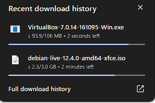

Asensin lataamani VirtualBoxin tallennustila D:hen sille luomaani kansioon. Tähän mennessä kaikki oli sujunut melko nopeasti ja ongelmitta, ja kello olikin 21:57, kun sain tämän osion valmiiksi.

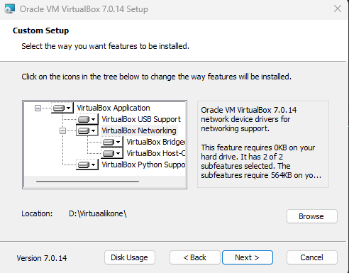

### Virtuaalikoneen luominen

Seurasin virtuaalikoneen luomiseen ohjeita samalta [sivustolta](https://terokarvinen.com/2021/install-debian-on-virtualbox/?fromSearch=virtualbox) mistä olin ladannut Debianin. Aloin luomaan uutta virtuaalitietokonetta ja laitoin Expert-moden päälle. Asetin virtuaalikoneen nimeksi Debian ja tallennuspaikaksi aiemmin tekemäni kansion. Lisäksi asetin levykuvaksi aiemmin lataamani Debian Live Linuxin.

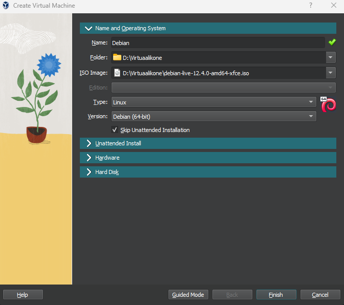

Asetin koneelle muistia 5 GB sekä neljä prosessorinydintä. 

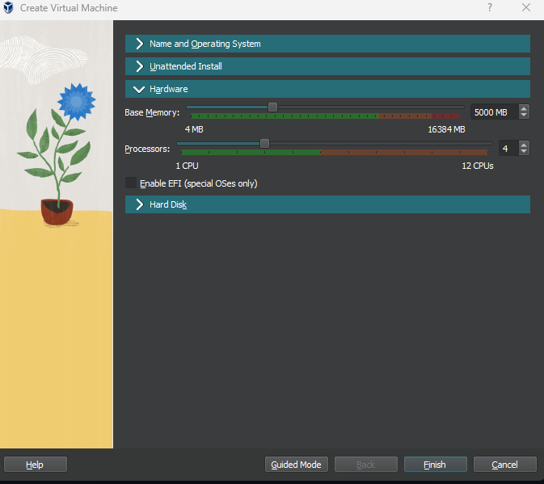

Kovalevyn kooksi asetin 60 GB ja jätin allokoinnin pois päältä, jotta virtuaalikone vie vain sen tilan jota se todellisuudessa käyttää.

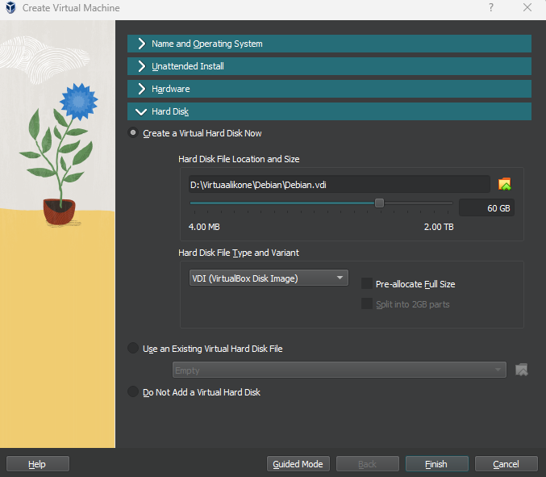

Tässä vaiheessa huomasinkin, etten saa luotua virtuaalikonetta. Ongelma kuitenkin ratkesi yksinkertaisesti, sillä käynnistin Virtualboxin uudestaan järjestelmänvalvojana, jolloin se antoi minun luoda virtuaalikoneen. Tässä vaiheessa kello oli 22:33, kun sain virtuaalitietokoneen valmiiksi.

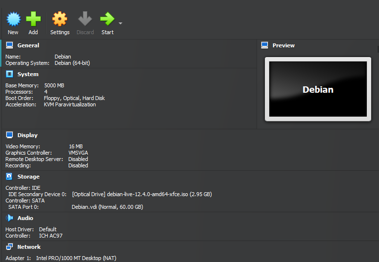

### Virtuaalitietokoneen käyttö ja Linuxin asennus

Kun yritin käynnistää virtuaalikonetta, törmäsin virheilmoitukseen jossa ilmoitettiin, että VT-x on pois käytöstä BIOS:ssa. Tämän korjaamiseksi minun täytyi käynnistää tietokone uudelleen, mennä BIOS:iin ja ottaa käyttöön Intel (VMX) Virtualization Technology -asetus. Otin tapahtumasta kuvan puhelimella. Ratkaisun ongelmaan löysin [tältä sivustolta](https://www.partitionwizard.com/partitionmanager/not-in-a-hypervisor-partition.html).

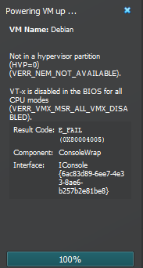

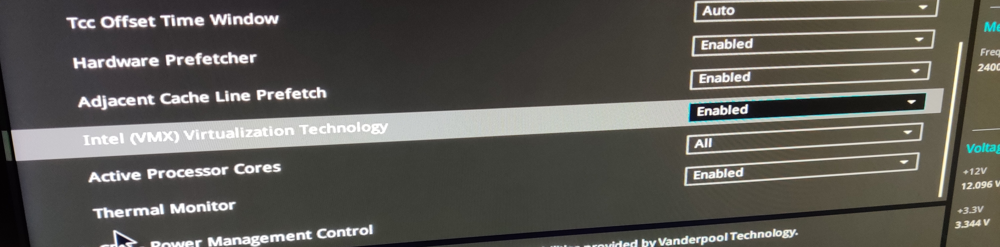

Korjauksen jälkeen virtuaalitietokone käynnistyi ongelmitta. Testailin virtuaalikonetta hieman käymällä Teron [verkkosivustolla](https://terokarvinen.com/) ja kaikki tuntui toimivan moitteettomasti. Näppäinjärjestelmä ei toistanut oikein ääkkösiä, mutta se olikin odotettavissa ennen käyttöjärjestelmän latausta.

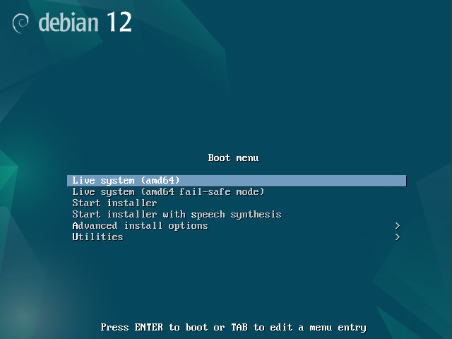

Seuraavaksi aloin asentamaan Debian Linuxia. Asetin käyttöjärjestelmän kieleksi englannin sekä sijainniksi Helsingin. Näppäimistön kieleksi annoin suomen, jotta ääkköset toimivat oikein. Asetin tietokoneen alustumaan, sillä upouudella virtuaalikoneella ei ole mitään tärkeää tietoa ja se on varmin tapa saada asennus onnistumaan oikein (Karvinen 2021). Seuraavaksi asetin nimeni ja tietokoneeseen kirjautumiseen käytettävän nimen. Tietokoneen nimeksi annoin anonyymisti "virtuaalikone", sillä se voi olla muille käyttäjille näkyvissä. Seuraavaksi asetin tietoturvallisen salasanan käyttämälläni salasanageneraattorilla.

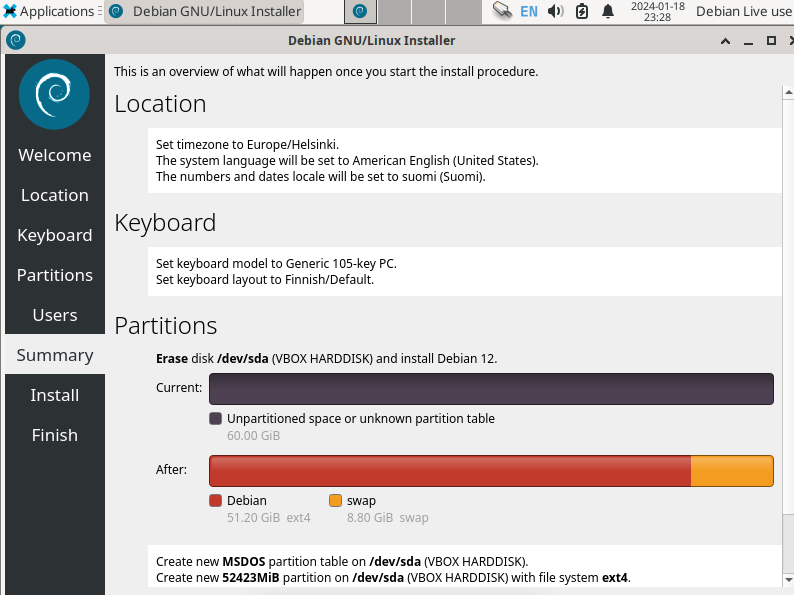

Tämän jälkeen jäljellä olikin vain odotella asennuksen valmistumista. Kello oli tässä vaiheessa 23:32. Asennus valmistui 23:38, ja siinä ei näyttänyt olevan ongelmia. Kokeilin taas Teron [verkkosivustolle](https://terokarvinen.com/) menemistä, ja tällä kertaa ääkkösetkin toimivat odotetulla tavalla. Lopuksi testasin vielä komentokehotetta käskyllä $ cat /etc/os-release, jolloin sain tiedon nykyisestä käyttöjärjestelmästä, joka oli tehtävänannon mukainen. Tiedon komennosta sain [tältä sivustolta](https://www.geeksforgeeks.org/how-to-check-the-os-version-in-linux/).

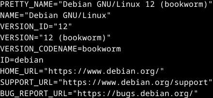

Aloitin tehtävän klo 21:40 ja sain sen päätökseen 23:45. Tehtävässä oli pari ongelmaa matkalla, mutta onnistuin korjaamaan ne itsenäisesti tiedonhaun avulla. Muuten tehtävä sujuikin hyvin, ja uskon, että jatkossa osaan tehdä prosessin vielä nopeampaa. Toki kirjoitin samalla myös tämän raportin, jolloin aikaa meni hieman myös asioiden taltioimiseen. Olen tyytyväinen lopputulokseen, ja mielestäni onnistuinkin tässä tehtävänannon mukaisesti.

## Lähteet

Portalpirate. 29.11.2023. Check the OS Version in Linux. GeeksforGeeks. Luettavissa: [https://www.geeksforgeeks.org/how-to-check-the-os-version-in-linux/](https://www.geeksforgeeks.org/how-to-check-the-os-version-in-linux/). Luettu: 18.01.2024.

GNU Operating System. s.a. What is Free Software? GNU Operating System. Luettavissa: [https://www.gnu.org/philosophy/free-sw.html](https://www.gnu.org/philosophy/free-sw.html). Luettu: 18.01.2024.

Karvinen, T. 2024. Linux Palvelimet 2024 alkukevät. Tero Karvisen verkkosivusto. Luettavissa: [https://terokarvinen.com/2024/linux-palvelimet-2024-alkukevat/](https://terokarvinen.com/2024/linux-palvelimet-2024-alkukevat/). Luettu: 18.01.2024.

Karvinen, T. 2021. Install Debian on Virtualbox - Updated 2023. Tero Karvisen verkkosivusto. Luettavissa: [https://terokarvinen.com/2021/install-debian-on-virtualbox/](https://terokarvinen.com/2021/install-debian-on-virtualbox/). Luettu: 18.01.2024.

Karvinen, T. 04.06.2006. Raportin kirjoittaminen. Tero Karvisen verkkosivusto. Luettavissa: [https://terokarvinen.com/2006/raportin-kirjoittaminen-4/](https://terokarvinen.com/2006/raportin-kirjoittaminen-4/). Luettu: 18.01.2024.

Linda. 25.12.2023. How to Fix Not in a Hypervisor Partition Error. Minitool. Luettavissa: [https://www.partitionwizard.com/partitionmanager/not-in-a-hypervisor-partition.html](https://www.partitionwizard.com/partitionmanager/not-in-a-hypervisor-partition.html). Luettu: 18.03.2024.

VirtualBox. s.a. Download Virtualbox. Oracle. Luettavissa: [https://www.virtualbox.org/wiki/Downloads](https://www.virtualbox.org/wiki/Downloads). Luettu: 18.01.2024.
