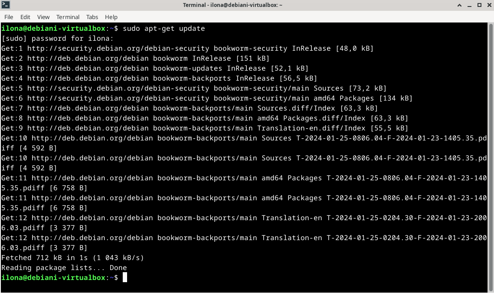
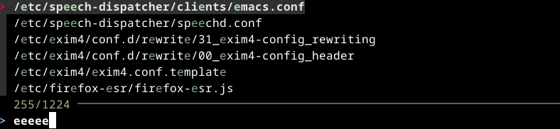
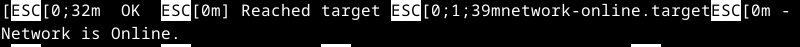

# H2 Komentaja pingviini

Toisen viikon tehtävänä on opiskella komentorivin käyttöä Linuxissa. Harjoittelu aloitetaan tiivistämällä Command line basics revisited -artikkeli ja sen jälkeen opittuja komentoja harjoitellaan käytännössä aiemmin kurssilla tekemämme virtuaalikoneen terminaaliohjelmassa. (Karvinen 2024.)

## Command line basics revisited

- Komentoriviä on käytetty tietokoneissa jo ennen Internetin keksimistä, ja sen käyttö on yhä yleistä Linuxissa.
- Komentorivi kohdistuu aina tietokoneessa olevaan johonkin hakemistoon, ja käytössä olevaa hakemistoa kutsutaan työhakemistoksi. Hakemistoja voi tarkastella (_$ pwd_) ja niiden välillä voi liikkua (_$ cd_). Uuden hakemiston luominen hoituu komennolla _$ mkdir_. 
- Komentorivillä voi myös muokata ja luoda tiedostoja (_esim. nano-teksinkäsittelyohjelmalla käskyllä $ nano_). Tiedostoja voi tarkastella komennolla _$ less_.
- Komennoilla voi myös siirtää (_$ mv_), kopioida (_$ cp_) ja poistaa (_$ rm_) tiedostoja ja hakemistoja.
- Komentoriviltä voidaan myös käyttää toista tietokonetta turvallisesti ottamalla etäyhteyden SSH:lla.
- Komentojen manuaalit löytyvät laittamalla _$ man_ ennen tarkasteltavaa komentoa.
- Linuxin juurihakemiston (_merkataan /_) alta löytyvät kaikki muut hakemistot, ja sen alta voi löytää esimerkiksi käyttäjien kotihakemistot (_/home/käyttäjä/_), asetukset (_/etc/_) sekä lokitiedostot (_/var/log/_).
- Järjestelmän toimintaan vaikuttavat komennot vaativat pääkäyttäjän oikeuksia, joten nämä komennot täytyy suorittaa pääkäyttäjänä (_$ sudo ennen haluttua komentoa_).

(Karvinen 2020)

## Komentorivi-harjoitukset

Aloitin tehtävät klo 23:20. Tehtävien tekemiseen käytin viimeksi luomaani virtuaalikonetta Debian LinuxAROWORAW. Käynnistin komentojen suorittamista varten terminaaliohjelman, joka oli jo valmiiksi asennettuna käyttöjärjestelmään. En ollut käyttänyt virtuaalikonetta vähään aikaan, joten ensimmäiseksi minun täytyi päivittää pakettilista. Pakettilistan päivitys tulee tehdä siksi, että järjestelmä on ajan tasalla uusimmista paketeista, jolloin se osaa asentaa uusimmat ja usein ne toimivimmat ohjelmapaketit. Välillä järjestelmä ei myöskään löydä paketteja, jos se etsii niitä vanhentuneella tiedolla. (Jeet 5.12.2017.) Pakettilistan päivitys tehdään pääkäyttäjänä, sillä peruskäyttäjän oikeudet eivät salli sen päivitystä. 

    $ sudo apt-get update

### Micro-editorin asennus

Kun olin saanut alkuvalmistelut tehtyä ryhdyin [Micron](https://micro-editor.github.io/) asennukseen. Se on terminaalikäyttöinen tekstinkäsittelyohjelma. Asennus sujui ongelmitta muutamissa sekunneissa ja siihen käytin seuravaa komentoa. Komentoon lisättiin -y, jolloin se vastaa kyllä automaattisesti mahdollisesti tuleviin kysymyksiin.

    $ sudo apt-get -y install micro

### Raudan tarkastelu

Seuraavaksi tarkastelin koneen laitteistoa seuraavalla komennolla. Komentoa suorittaessa huomasin, ettei minulla ollut tarvittavaa lshw -ohjelmaa, joten asensin sen samalla tavalla, kuin yllä olevan Micro-editorin, tosin vaihdoin 'micron' tilalle 'lshw'. Kun suoritin komennon, sain pitkän listan koneen raudasta. Alla olevassa listauksessa on rauta selitettynä. Kello oli 1:00 kun sain tämän osion suoritettua, ja päätinkin jatkaa hommaa seuraavana päivänä uudestaan.

    $ sudo lshw -short -sanitize

- System : Virtualboxin luoma järjestelmä
-  Bus: Virtualboxin luoma laiteväylä
-  Memory: BIOS:in muisti 128 KB
-  Memory: Keskusmuisti 5 GB
-  Processor: Intel i5-9600k prosessori
-  Bridge: Intelin piirisarja
-  Bridge: Intelin piirisarja
-  Input: Plug and Play-laite
-  Input: Plug an Play-laite
-  Storage: Intel-pohjainen IDE-ohjain CD-asemalle
-  Disk: CD-asema
-  Display: Virtualboxin luoma näytönsovitin, joka mahdollistaa virtualikoneen näytön näyttämisen oikean kokoisena Quest Additionsin asentamisen myötä
-  Network: Intel-pohjainen Ethernet-ohjain
-  Input: Virtualboxin hiiren integrointi, jonka avulla hiiri liikkuu sulavasti virtuaalikoneen ja oman koneeni välillä
-  Multimedia: Intelin ääniohjain
-  Bus: USB-ohjain
-  Bus: USB-ohjain
-  Input: Virtualboxin osoitinlaite
-  Bridge: Intelin IDE-verkkosilta
-  Bus: USB 2.0-ohjain
-  Bus: Intelin USB 2.0-isäntäohjain
-  Storage: Intelin SATA-tallennusohjain virtuaalikoneen massamuistille
-  Disk: Virtualboxin luoma 42 GB kovalevy
-  Volume: Useissa Linuxeissa käytetty EXT4-tietojärjestelmä, joka tallentaa dataa lohkoina. Muistia sillä on 31 GB.
-  Volume: Linuxissa käytetty swap-muisti, joka käytetään mikäli keskusmuistilta loppuu tila. Muistia sillä on n. 9 GB.
-  Input0: Näppäimistö
-  Input2: Virtapainike
-  Input3: Videoväylä
-  Input4: Lepotilapainike
-  Input5: Hiiri
-  Input7: Kaiutin

### Kolme uutta komentoriviohjelmaa
   
Jatkoin harjoitusta seuraavana päivänä klo 7.00. Valitsin asennettaviksi komentoriviohjelmiksi seuraavat: [Thefuck](https://github.com/nvbn/thefuck) - ohjelma joka korjaa väärin kirjoitetut komennot, [Fzf](https://github.com/junegunn/fzf) - ohjelma jolla voi hakea hakemistoja tai tiedostoja ja [Bpytop](https://github.com/aristocratos/bpytop) - ohjelma tietokoneen toiminnan seuraamiseen. Asennus onnistui nopeasti muutamissa sekunneissa ongelmitta. 

    $ sudo apt-get -y install thefuck fzf bpytop

### Tärkeät kansiot 

Seuraavaksi tutustuin tärkeisiin kansioihin. Aloitin ylimmästä / kansiosta, joka on juurihakemisto, jonka alta kaikki koneen sisältö löytyy. Juurihakemistoon pääsin kirjoittamalla kaksi kertaa seuraavan komennon, joka siirtää hakemistoa asteen ylöspäin. Se sisälsi seuraavassa kuvassa olevat kansiot.

    $ cd ..

Seuraavaksi siirryin /etc/ kansioon. Siihen pääsin kirjoittamalla seuraavan komennon juurihakemistossa. Se sisältää järjestelmän asetuksia. Seuraavassa kuvassa tarkastelin mitä timezone -tiedosto sisältää, ja siitä näkyi, että aikavyöhykkeeksi on asetettu Europe/Helsinki.

    $ cd etc

Palasin ylöspäin juurihakemistoon ja siirryin /var/log/ hakemistoon seuraavalla komennolla. Tämä kansio sisälsi järjestelmän lokeja. Tutustuin boot.log -kansion sisältöön ja se sisälsi odotetusti lokeja järjestelmästä. Otin kuvan esimerkiksi lokista, josta selviää että tietokone on yhdistettynä Internettiin.

    $ cd var/log

Palasin taas juurihakemistoon ja siirryin /media/ kansioon seuraavalla komennolla. Tämä kansio sisältää poistuvan sisällön, kuten esimerkiksi USB-tikun sisällön. Kansio sisälsi kaksi piilotettua hakemistoa, ja hakemiston käyttäjäni nimellä.

    $ cd media 

Siirryin taas takaisin juurihakemistoon, ja siitä siirryin /home/ kansioon. Se sisältää jokaisen käyttäjän oman hakemiston. Koska koneella ei ole muita käyttäjiä kuin omani, se sisälsi vain yhden hakemiston käyttäjäni nimellä.

    $ cd home

Siirryin /home/ kansiosta käyttäjäni /home/ilona/ kansioon. Se on kotihakemisto käyttäjälleni, johon voin tallentaa haluamaani sisältöä. Se sisälsi seuraavia kansioita.

    $ cd ilona

### Grep-komento

Harjoittelua varten tein moikka.txt tiedoston työpöydälleni. Se sisälsi pari tervehdystä. Seuraavalla komento tulosti kaikki rivit, joihin olin kirjoittanut "hello".

    $ grep "hello" moikka.txt

Seuraavalla komennolla sain tietää montako kertaa tiedosto sisältää sanan "hello". Sain tulokseksi 3.

    $ grep -c "hello" moikka.txt

Seuraavalla komennolla sain tulostettua kaikki rivit, jotka sisältävät sanan "HELLO", välittämättä siitä, ovatko kirjaimet isoja vai pieniä.

    $ grep -i "HELLO" moikka.txt

(Pankaj 3.8.2022)

### Putket

## Lähteet

Karvinen, T. 2024. Linux Palvelimet 2024 alkukevät. Tero Karvisen verkkosivusto. Luettavissa: [https://terokarvinen.com/2024/linux-palvelimet-2024-alkukevat/](https://terokarvinen.com/2024/linux-palvelimet-2024-alkukevat/). Luettu: 25.01.2024.

Karvinen, T. 2020. Command Line Basics Revisited. Tero Karvisen verkkosivusto. Luettavissa: [https://terokarvinen.com/2020/command-line-basics-revisited/?fromSearch=command%20line%20basics%20revisited](https://terokarvinen.com/2020/command-line-basics-revisited/?fromSearch=command%20line%20basics%20revisited). Luettu: 25.01.2024.

Jeet S. 5.12.2017. Why to run sudo apt-get update everytime?. LinkedIn. Luettavissa: [https://www.linkedin.com/pulse/why-run-sudo-apt-get-update-everytime-jitendra-sikarwar/](https://www.linkedin.com/pulse/why-run-sudo-apt-get-update-everytime-jitendra-sikarwar/). Luettu: 26.01.2024.

Pankaj. 3.8.2022. Grep Command in Linux/UNIX. DigitalOcean, LLC. Luettavissa: [https://www.digitalocean.com/community/tutorials/grep-command-in-linux-unix](https://www.digitalocean.com/community/tutorials/grep-command-in-linux-unix). Luettu: 29.01.2024.
