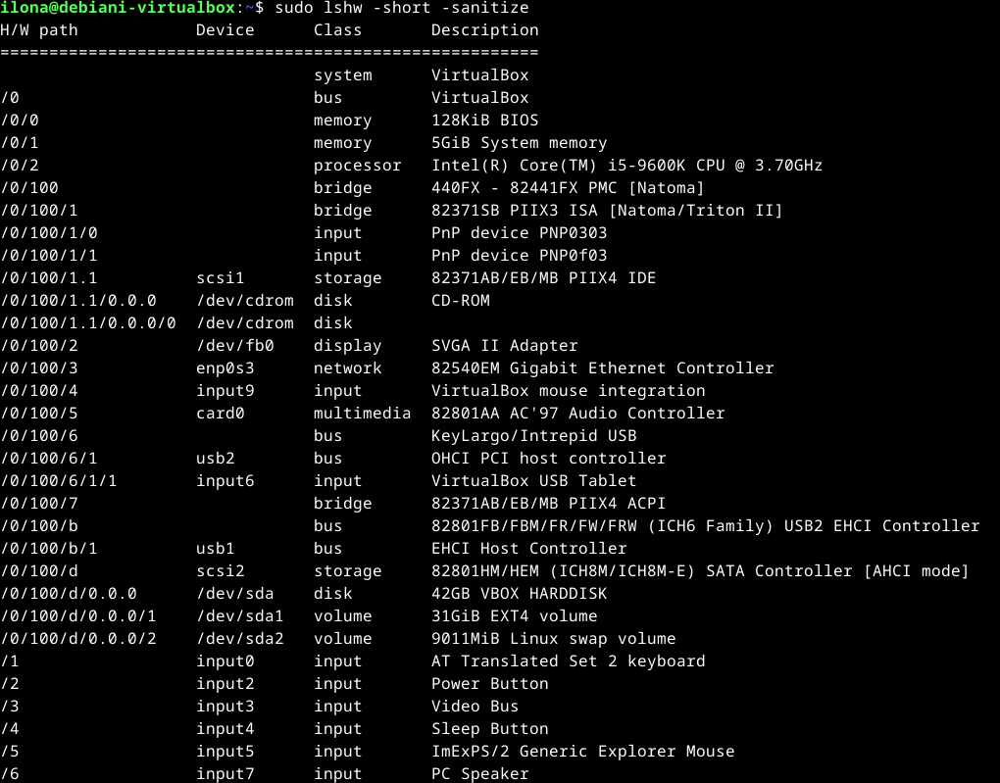

# H2 Komentaja pingviini

Toisen viikon tehtävänä on opiskella komentorivin käyttöä Linuxissa. Harjoittelu aloitetaan tiivistämällä Command line basics revisited -artikkeli ja sen jälkeen opittuja komentoja harjoitellaan käytännössä aiemmin kurssilla tekemämme virtuaalikoneen terminaaliohjelmassa. (Karvinen 2024.)

## Command line basics revisited

- Komentoriviä on käytetty tietokoneissa jo ennen Internetin keksimistä, ja sen käyttö on yhä yleistä Linuxissa.
- Komentorivi kohdistuu aina tietokoneessa olevaan johonkin hakemistoon, ja käytössä olevaa hakemistoa kutsutaan työhakemistoksi. Hakemistoja voi tarkastella (_$ pwd_) ja niiden välillä voi liikkua (_$ cd_). Uuden hakemiston luominen hoituu komennolla _$ mkdir_. 
- Komentorivillä voi myös muokata ja luoda tiedostoja (_esim. nano-teksinkäsittelyohjelmalla käskyllä $ nano_). Tiedostoja voi tarkastella komennolla _$ less_.
- Komennoilla voi myös siirtää (_$ mv_), kopioida (_$ cp_) ja poistaa (_$ rm_) tiedostoja ja hakemistoja.
- Komentoriviltä voidaan myös käyttää toista tietokonetta turvallisesti ottamalla etäyhteyden SSH:lla.
- Komentojen manuaalit löytyvät laittamalla _$ man_ ennen tarkasteltavaa komentoa.
- Linuxin juurihakemiston (_merkataan /_) alta löytyvät kaikki muut hakemistot, ja sen alta voi löytää esimerkiksi käyttäjien kotihakemistot (_/home/käyttäjä/_), asetukset (_/etc/_) sekä lokitiedostot (_/var/log/_).
- Järjestelmän toimintaan vaikuttavat komennot vaativat pääkäyttäjän oikeuksia, joten nämä komennot täytyy suorittaa pääkäyttäjänä (_$ sudo ennen haluttua komentoa_).

(Karvinen 2020)

## Komentorivi-harjoitukset

Aloitin tehtävät klo 23:20. Tehtävien tekemiseen käytin viimeksi luomaani virtuaalikonetta Debian LinuxAROWORAW. Käynnistin komentojen suorittamista varten terminaaliohjelman, joka oli jo valmiiksi asennettuna käyttöjärjestelmään. En ollut käyttänyt virtuaalikonetta vähään aikaan, joten ensimmäiseksi minun täytyi päivittää pakettilista. Pakettilistan päivitys tulee tehdä siksi, että järjestelmä on ajan tasalla uusimmista paketeista, jolloin se osaa asentaa uusimmat ja usein ne toimivimmat ohjelmapaketit. Välillä järjestelmä ei myöskään löydä paketteja, jos se etsii niitä vanhentuneella tiedolla. (Jeet 5.12.2017.) Pakettilistan päivitys tehdään pääkäyttäjänä, sillä peruskäyttäjän oikeudet eivät salli sen päivitystä. 

    $ sudo apt-get update

### Micro-editorin asennus

Kun olin saanut alkuvalmistelut tehtyä ryhdyin [Micron](https://micro-editor.github.io/) asennukseen. Se on terminaalikäyttöinen tekstinkäsittelyohjelma. Asennus sujui ongelmitta muutamissa sekunneissa ja siihen käytin seuravaa komentoa. Komentoon lisättiin -y, jolloin se vastaa kyllä automaattisesti mahdollisesti tuleviin kysymyksiin.

    $ sudo apt-get -y install micro

### Raudan tarkastelu

Seuraavaksi tarkastelin koneen laitteistoa seuraavalla komennolla. Komentoa suorittaessa huomasin, ettei minulla ollut tarvittavaa lshw -ohjelmaa, joten asensin sen samalla tavalla, kuin yllä olevan Micro-editorin, tosin vaihdoin 'micron' tilalle 'lshw'. Kun suoritin komennon, sain pitkän listan koneen raudasta. Tietokoneen järjestelmäksi ja väyläksi on ilmoitettu VirtualBox, sillä käyttämäni tietokone on sillä luotu virtuaalikone. Keskusmuistia tietokoneella on virtuaalikonetta luodessa asettamani 5 GB:tä, ja BIOS:lle varattua pitkäkestoista musitia on 128 KB. Tietokoneen prosessori on 15-0600k, eli sama kuin virtuaalikoneen alla toimivassa tietokoneessani. Piirisarjat ovat myös Intelin tuotantoa. Syötteessä on kytkettynä kaksi Plug and Play -laitetta. Tallennusohjain on Intel-pohjainen IDE-ohjain. 

    $ sudo lshw -short -sanitize

   

## Lähteet

Karvinen, T. 2024. Linux Palvelimet 2024 alkukevät. Tero Karvisen verkkosivusto. Luettavissa: [https://terokarvinen.com/2024/linux-palvelimet-2024-alkukevat/](https://terokarvinen.com/2024/linux-palvelimet-2024-alkukevat/). Luettu: 25.01.2024.

Karvinen, T. 2020. Command Line Basics Revisited. Tero Karvisen verkkosivusto. Luettavissa: [https://terokarvinen.com/2020/command-line-basics-revisited/?fromSearch=command%20line%20basics%20revisited](https://terokarvinen.com/2020/command-line-basics-revisited/?fromSearch=command%20line%20basics%20revisited). Luettu: 25.01.2024.

Jeet S. 5.12.2017. Why to run sudo apt-get update everytime?. LinkedIn. Luettavissa: [https://www.linkedin.com/pulse/why-run-sudo-apt-get-update-everytime-jitendra-sikarwar/](https://www.linkedin.com/pulse/why-run-sudo-apt-get-update-everytime-jitendra-sikarwar/). Luettu: 26.01.2024.
