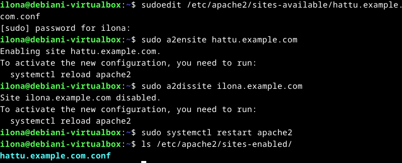

# H3 Hello Web Server

Kolmannen viikon ensimmäinen tehtävä oli tiivistää artikkelit [Name-Based Virtual Host Support](https://httpd.apache.org/docs/2.4/vhosts/name-based.html) sekä [Name-Based Virtualhosts on Apache - Multiple Websites to Single IP Address](https://terokarvinen.com/2018/04/10/name-based-virtual-hosts-on-apache-multiple-websites-to-single-ip-address/). Sen jälkeen pääsinkin taas harjoittelemaan luomani virtuaalikoneen kanssa, ja tällä viikolla oli tehtävänä luoda nimipohjaisia virtual-hosteja Apache-weppipalvelimelle sekä analysoida niiden toimintaa. (Karvinen 2024.)

## Tiivistelmät

### Name-based Virtual Host Support

- Nimipohjaisessa virtual hostingissa pystytään lisäämään useampi host saman IP-osoitteen alle, toisinkuin IP-pohjaisessa hostingissa jokainen host tarvitsee erillisen IP-osoitteen.
- Kun käyttäjältä tulee pyyntö yhdistää sivustoon, määrittelee Apache ensimmäiseksi yhdistettävän osoitteen IP-osoitteesta ja käytetystä portista. Mikäli kyseisessä osoitteessa on useampi host, Apache tarkentaa oikean osoitteen ServerNamesta ja ServerAliaksesta.
- Mikäli pyynnön kanssa yhteensopivaa ServerNamea tai ServerAliasta ei löydy, käytetään ensimmäiseksi listattua hostia.
- Kun virtual hostia luodaan, tulee sen sisältää vähintään ServerName (nimi, jolla host määritellään) ja DocumentRoot (polku, mistä hakemistosta näytettävä sisältö haetaan). Se voi myös sisältää ServerAliaksen (vaihtoehtoiset nimet, jolla pääsee samalle sivustolle).
- Julkaistavan hostin nimiä ei kuitenkaan voi keksiä miten sattuu, sillä ne täytyy olla määritelty DNS-palvelimelle niin, että ne on liitetty käytettyyn IP-osoitteeseen.

(The Apache Software Foundation s.a.)

### Name Based Virtual Hosts on Apache - Multiple Websites to Single IP Address

- Apachen voi asentaa käskyllä _$ sudo apt-get -y install apache2_.
- Uuden nimipohjaisen hostin voi luoda tekemällä uuden tiedoston kansioon _/etc/sites-available/_. Hostin nimen tulee päättyä _.conf_. Tiedoston luominen tulee tehdä pääkäyttäjänä. Esimerkkinä komennosta tiedoston luomiseen voisi olla _$ sudoedit /etc/sites-available/ilona.example.com.conf_.
- Sisällöksi host-tiedostoon tulisi lisätä portti, ServerName, DocumentRoot sekä halutessasi ServerAlias.
- Host tulee ottaa käyttöön komennolla _$ sudo a2ensite ilona.example.com_. Apache ei löydä uutta hostia ilman uudelleenkäynnistystä, joten se tulee tehdä komennolla _$ sudo systemctl restart apache2_.
- Sivustolle tulee myös luoda vähintään index html-tiedosto, jotta hostilla on jotain, mitä näyttää sivustolla. Tämä tiedosto tulee luoda siihen hakemistoon, joka on asetettu DocumentRoottiin. Tässä esimerkissä tiedosto voisi sijaita hakemistossa _/home/ilona/publicsites/ilona.example.com_.
- Sivustoa voi testata käskyllä _$ curl localhost_ tai selaimessa kirjoittamalla _http://localhost_ osoitekenttään.
- Tämä menetelmä ei vielä suoraan tee julkista verkkosivua, vaan julkaistavan sivuston verkkotunnus tulisi olla vuokrattuna rekisteröintejä tarjoavalta yritykseltä.

(Karvinen 10.04.2018.)

## Weppipalvelin-harjoitukset

Käytin tehtävään taas aikaisemmin luomaani Debian Linux-virtuaalikonetta. Koneen rautaa voi tarkastella tarkemmin [edellisestä raportista](https://github.com/Ilona-Hiltunen/linux-course2024/blob/main/h2_komentaja_pingviini.md).

### Weppipalvelimen vastaaminen localhost-osoitteesta

Testasin weppipalvelimen vastaamista localhost -osoitteesta viime oppitunnilla tekemälläni hostilla. Kirjoitin `$ curl localhost` komentoriville. Komentorivi palautti vastaukseksi `index.html`-tiedostoon kirjoittamani tekstin, joten päättelin, että Apache-weppipalvelin toimii odotetulla tavalla. Testasin ohjelmaa vielä selaimella osoitteesta http://localhost/, ja sekin palautti kirjoittamani tekstin.

### Lokien tutkiminen

Menin localhostiin curlilla ja selaimen kautta, ja sain seuraavat lokit siitä tiedostoon /var/log/apache2/other_vhosts_access.log. Seuraavassa listauksessa ovat lokien osat selitettyinä, esimerkit ovat otettu alemmalta riviltä.

- hattu.example.com:80 = Sivusto ja portti mihin pyyntö on tehty.
- 127.0.0.1 = IP-osoite mistä pyyntö on tehty.
- '-' = Tietoa ei ole saatavilla, mutta tämä viittaisi RFC 14-13 identiteettiin. Tämä tieto ei ole kovin luotettava, jonka vuoksi Apache ei lähtökohtaisesti yritä tunnistaa tätä.
- '-' = Tietoa ei ole saatavilla, mutta tämä viittaa käyttäjänimeen.
- [01/Feb/2024:06:55:03 +0200] = Päivämäärä ja kellonaika, sekä aikavyöhyke.
- "GET / HTTP/1.1" = Pyyntöön käytetty metodi, pyydetty resurssi ja käytetty protokolla.
- 200 = Palvelimen käyttäjälle palauttama koodi. Numerolla 2 alkavat koodit ilmaisevat palvelimen vastaamisen onnistuneen, kun taas 3-alkuiset koodit viittaavat uudelleenohjaukseen. Numerolla 4 ja 5 alkavat koodit viittaavat virheeseen.
- 406 = Käyttäjälle lähetetyn paketin koko.
- "-" = Tietoa ei ole saatavilla, mutta tämä viittaisi sivustoon, josta käyttäjä on siirtynyt.
- "curl/7.88.1" = Käyttäjän käyttämän ohjelman ilmoittamat tiedot.

(The Apache Software Foundation s.a.)

### Uuden hostin teko

Aloitin uuden nimipohjaisen virtual hostin teon. Katsoin ohjeet sen tekoon [Tero karvisen sivustolta](https://terokarvinen.com/2018/04/10/name-based-virtual-hosts-on-apache-multiple-websites-to-single-ip-address/). Aloitin hostin tekemisen tekemällä uuden tiedoston /etc/apache2/sites-available kansioon käskyllä:

    $ sudoedit /etc/apache2/sitesavailable/hattu.example.com.conf
  
Kirjoitin host-tiedoston sisältöön portin, ServerNamen, ServerAliaksen ja Documentrootin kuvan mukaisella syntaksilla.

Otin uuden hostin käyttöön komennolla:
    
    $ sudo a2ensite hattu.example.com 
    
Otin pois käytöstä vanhan tunnilla tehdyn hostin komennolla:

    $ sudo a2dissite ilona.example.com
  
Tämän jälkeen käynnistin Apachen uudelleen seuraavalla komennolla, jotta uusi host päivittyy.

    $ sudo systemctl restart apache2
    
Sitten vielä tarkistin, että host on ilmestynyt /etc/apache2/sites-enabled kansioon, mistä selvisi, että host on otettu käyttöön ja vanha host on poistunut käytöstä.

Tässä vaiheessa tein hakemiston mihin Documentroot osoittaa. Tein sen siis osoitteeseen /home/ilona/publicsite/ komennolla:
    
    $ mkdir publicsite/hattu.example.com
    
Tein lisäksi luomaani kansioon index.html -tiedoston komennolla: 

    $ micro publicsite/hattu.example.com/index.html 

    
Nyt olin tehnyt tarvittavat toimenpiteet hostin luomiseksi, ja tarkistin vielä sen toimimisen selaimesta http://localhost/ osoitteesta. Host toimi odotetulla tavalla.

### HTML5 sivu

Avasin juuri tekemäni hostin index.html-tiedoston seuraavalla komennolla.

    $ micro publicsite/hattu.example.com/index.html 

Käytin apuna tiedoston muokkaamiseen [Tero karvisen ohjetta](https://terokarvinen.com/2012/short-html5-page/). Kirjoitin index.html -tiedoston sisällön seuraavan kuvan mukaisesti. Lopuksi vielä tarkistin sen [tällä validoijalla](https://validator.w3.org/). 

Selaimessa se näytti tältä, joten päättelin, että kirjoittamani HTML5 oli validi.

### Curl-komennot

Kokeilin curlia kahdella eri komennolla:

    $ curl localhost
    $ curl -I localhost

Ensimmäinen komento palautti sivun samassa HTML5-syntaksissa, missä olin kirjoittanutkin sen. Toinen komento taas ei palauttanut mitään sivun näkyvästä sisällöstä, vaan headerin sisällön. Toisen komennon vastauksessa näkyy pyynnön protokolla ja onnistuminen, sekä aika, jolloin se tehtiin. Lisäksi siitä selviää palvelin jolle pyyntö tehtiin sekä sivun päivityshistoria sekä versiointi. Siinä näkyy myös vähän sivun sisällöstä kuten sen koko tavuissa.

## Bonustehtävät

Yritin hankkia GitHub Education-pakettia, mutta sivusto ei hyväksynyt digitaalisessa muodossa olevaa opiskelutodistusta tai opiskelijakorttia. Minulla ei ollut tähän hätään mitään fyysistä todistetta, josta voisin ottaa kuvan, joten päätin jättää tämän siihen asti että käyn koululla hankkimassa opiskelutodistuksen.

### Kaksi eri sivua

Käytin tehtävään [Tero Karvisen ohjetta](https://terokarvinen.com/2018/04/10/name-based-virtual-hosts-on-apache-multiple-websites-to-single-ip-address/). Minulla oli jo valmiiksi luotuna kaksi hostia koneelleni, joten päätin käyttää niitä tässä tehtävässä ja olla luomatta uutta. Ensimmäinen host, jonka tein ylemmässä tehtävässä oli jo käytössä, joten minun tarvitsi ottaa käyttöön vain toinen host. Tein sen seuraavilla komennoilla, joista ensimmäisellä otin hostin käyttöön ja toisella käynnistin Apachen uudelleen.

    $ sudo a2ensite ilona.example.com
    $ sudo systemctl restart apache2

Tämän jälkeen kävin editoimassa hosts-tiedostoa seuraavalla komennolla. Lisäsin tiedostoon kuvassa olevan korostetun tekstin, jossa asetetaan samaan IP-osoitteeseen toinenkin osoite.

    $ sudoedit /etc/hosts

Tämän jälkeen testasin sivuston näkymistä localhostissa ja ilona.example.com:issa selaimella ja curl-komennolla. Molemmissa näkyi tekemäni sivut. 

## Lähteet

The Apache Software Foundation. s.a. Name-based Virtual Host Support. Luettavissa: [https://httpd.apache.org/docs/2.4/vhosts/name-based.html](https://httpd.apache.org/docs/2.4/vhosts/name-based.html). Luettu: 30.01.2024

The Apache Software Foundation. s.a. Log Files. Luettavissa: [https://httpd.apache.org/docs/2.4/logs.html#accesslog](https://httpd.apache.org/docs/2.4/logs.html#accesslog). Luettu: 31.01.2024.

Karvinen, T. 2024. Linux Palvelimet 2024 alkukevät. Tero Karvisen verkkosivusto. Luettavissa: [https://terokarvinen.com/2024/linux-palvelimet-2024-alkukevat/](https://terokarvinen.com/2024/linux-palvelimet-2024-alkukevat/). Luettu: 30.01.2024.

Karvinen, T. 10.04.2018. Name Based Virtual Hosts on Apache - Multiple Websites to Single IP Address. Tero Karvisen verkkosivusto. Luettavissa: [https://terokarvinen.com/2018/04/10/name-based-virtual-hosts-on-apache-multiple-websites-to-single-ip-address/](https://terokarvinen.com/2018/04/10/name-based-virtual-hosts-on-apache-multiple-websites-to-single-ip-address/). Luettu: 30.01.2024

Karvinen, T. 12.02.2012. Short HTML5 page. Tero Karvisen verkkosivusto. Luettavissa: [https://terokarvinen.com/2012/short-html5-page/](https://terokarvinen.com/2012/short-html5-page/). Luettu: 31.01.2024.

