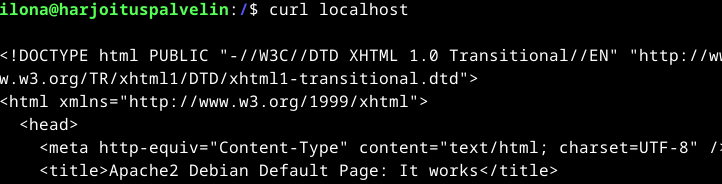
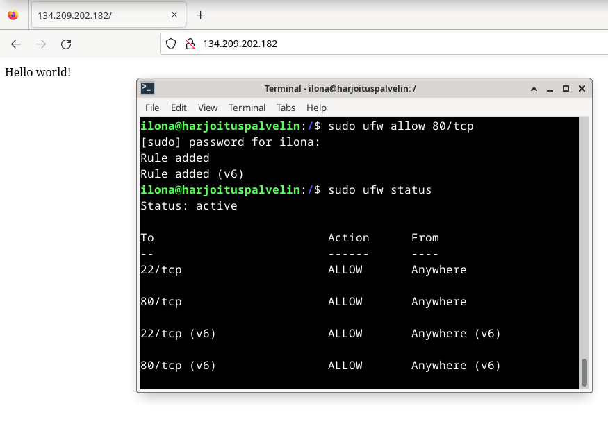
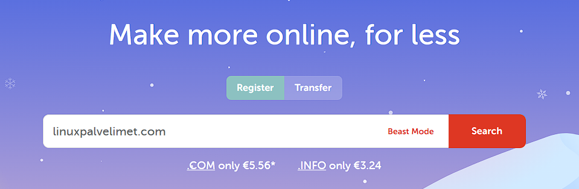
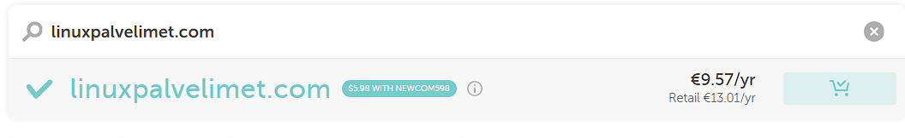
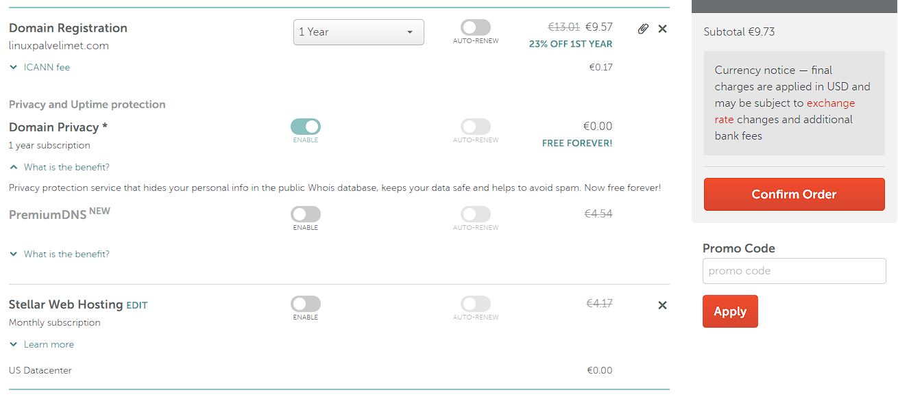
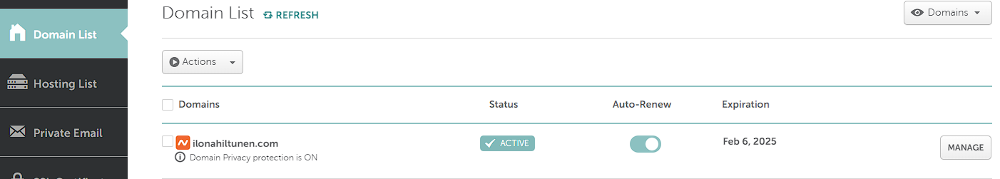
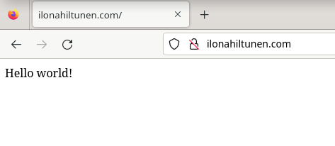

# H4 Maailma kuulee

Neljännen viikon tehtävänä oli tiivistää artikkelit [Teoriasta käytäntöön pilvipalvelimen avulla](https://susannalehto.fi/2022/teoriasta-kaytantoon-pilvipalvelimen-avulla-h4/) sekä [First Steps on a New Virtual Private Server – an Example on DigitalOcean and Ubuntu 16.04 LTS](https://terokarvinen.com/2017/first-steps-on-a-new-virtual-private-server-an-example-on-digitalocean/). Harjoituksina tuli vuokrata oma virtuaalipalvelin, tehdä sille alkutoimenpiteet ja vaihtaa Apachen testisivu omaan tuotokseen. Viimeisenä tuli vuokrata oma domain-nimi ja asettaa se osoittamaan juuri hankkimaamme virtuaalipalvelimeen. (Karvinen 2024.)

## Tiivistelmät

### Teoriasta käytäntöön pilvipalvelimen avulla

- Pilvipalvelimia voi vuokrata eri palveluntarjoajilta, esimerkiksi DigitalOcean tarjoaa palvelinten vuokrausta. Vuokrattava pilvipalvelimen tehokkuus tulee valita omien tarpeiden mukaan. On kuitenkin suositeltavaa aloittaa halvimmasta sopivasta vaihtoehdosta, sillä palvelimen tehoja saa helposti lisättyä jälkikäteenkin.
- Domain-nimiä voi myös vuokrata useilta eri palveluntarjoajilta, esimerkiksi Namecheap on tällainen. Vuokrattu nimi tulee osoittaa palvelimen IP-osoitteeseen, jotta domain-nimelle tuleva liikenne ohjautuu halutulle palvelimelle.
- Virtuaalipalvelinta voi käyttää halutulla tietokoneella SSH-yhteyden avulla.
- Kun palvelimen ottaa käyttöön, tulisi tehdä seuraavat toimenpiteet;
  - Suojata palvelin palomuurilla, sekä avata ainoastaan tarvittavat portit liikenteelle.
  - Tehdä oma pääkäyttäjä hyvällä salasanalla, ja sen jälkeen sulkea root.
  - Päivittää ja asentaa palvelimen ohjelmat.
- Näiden toimenpiteiden jälkeen palvelinta voi käyttää haluamaansa tarkoitukseen, esim. omille kotisivuille kuten artikkelin kirjoittaja oli tehnyt.
- Virtuaalipalvelimen lokeja voi tarkastella hakemistosta `/var/log/auth.log`, ja sieltä voi tunnistaa vaikkapa murtautumisyrityksiä.

(Lehto 14.02.2022.)

### First Steps on a New Virtual Private Server – an Example on DigitalOcean and Ubuntu 16.04 LTS

- Virtuaalipalvelimen fyysinen sijainti kannattaa valita loppukäyttäjien sijainnin mukaan, eli suomalaisille pidettävän sivuston palvelimen olisi hyvä sijaita Euroopassa.
- Kun virtuaalipalvelin on luotu, generoituu sille IP-osoite. Palvelinta voi käyttää SSH-yhteydellä komennolla `$ ssh root@palvelimen IP-osoite`.
- Ennen palomuurin käyttöönottoa, tulee palomuurin asetuksista sallia SSH-yhteys komennolla `$ sudo ufw allow 22/tcp`.
- Palvelimelle voi lisätä käyttäjän komennolla `$ sudo adduser kayttaja`. Samalla komennolla `$ sudo adduser kayttaja sudo` voi asettaa käyttäjän pääkäyttäjäksi.
- Palvelimen ohjelmistot kannattaa myös päivittää, sillä niiden vanhoissa versioissa on usein tietoturvauhkia.
- Kun palvelimelle asentaa julkisen weppipalvelimen tulee sen käyttämä portti avata palomuurin asetuksista komennolla `$ sudo ufw allow 80/tcp`.
- Kun koneelle on asennettu weppipalvelin, verkkosivustolle voi päästä palvelimen IP-osoitteella. Mikäli sivuston haluaa toimivan nimellä, tulee domain-nimi vuokrata palveluntarjoajalta ja yhdistää se palvelimen IP-osoitteeseen.

(Karvinen 19.09.2017)

## Virtuaalipalvelimen hankinta ja käyttöönotto

Aloitin tehtävien tekemisen klo 17:00 pohtimalla mitä palveluntarjoajaa käytän tehtävässä. Päädyin käyttämään [DigitalOceania](https://www.digitalocean.com/) virtuaalipalvelimen vuokraamiseen, sillä sain sinne ilmaiseksi 200$ edestä käyttövaroja GitHubin Education-paketin myötä. Käytin tehtävässä ohjeena artikkeleita [Teoriasta käytäntöön pilvipalvelimen avulla](https://susannalehto.fi/2022/teoriasta-kaytantoon-pilvipalvelimen-avulla-h4/) sekä [First Steps on a New Virtual Private Server – an Example on DigitalOcean and Ubuntu 16.04 LTS](https://terokarvinen.com/2017/first-steps-on-a-new-virtual-private-server-an-example-on-digitalocean/).

### Käyttöympäristö 

Tietokone: Virtualboxilla luotu virtuaalikone

Keskusmuisti: 5 GB

Massamuisti: 40 GB

Käyttöjärjestelmä: Debian 12 Bookworm (64-bit)

### Tunnuksen luominen ja virtuaalipalvelimen vuokraus

Menin DigitalOceanin aloitussivulle ja painoin `Sign up`. Aloitin tunnuksien tekemisen syöttämällä nimeni ja sähköpostini. Tämän jälkeen minun tuli täyttää kysely, jossa kysyttiin mm. mihin aion Digital Oceania käyttää ja mikä rooli minulla vuokraajana on. Lopuksi asetin maksutietoni, ja DigitalOcean vuorostaan vahvisti ne tekemällä 0,95 € katevarauksen. Rekisteröinti oli valmis ja pääsinkin aloitusnäkymään. Yhdistin vielä GitHub-tunnukseni tekemääni käyttäjätunnukseen, jotta sain käyttööni luvatut 200$. Nyt olin valmis aloittamaan palvelimen vuokrauksen.

Painoin aloitussivulta kohtaa `Deploy a virtual machine` ja pääsin luomaan virtuaalipalvelinta, joka DigitalOceanissa oli nimetty Dropletiksi. Asetin palvelimen sijainniksi Amsterdamin, sillä sivuston loppukäyttäjät ovat suomalaisia. Näin välimatka Suomeen ja siten palvelimen vastausaikakin tulisi olla lyhyempi (Karvinen 06.02.2024). 

Valitsin käyttöjärjestelmäksi Debianin uusimman version, sillä olimme harjoitelleet sen käyttöä tällä kurssilla. Lisäksi valitsin palvelimen tyypiksi jaetun.

Sivusto ehdotti minulle aluksi melko kallista palvelinta, mutta päätin vuokrata 6$ kuussa maksavan palvelimen, jossa on 1 GB keskusmuistia ja 25 GB säilytystilaa. Sivusto tarjosi myös erilaisia lisäpalveluita kuten ylimääräistä levytilaa, mutta en ottanut mitään näistä lisäpalveluista. 

Asetin palvelimen salasanaksi turvallisen salasanageneraattorilla luodun salasanan. Lopuksi jäljellä olikin vain enää virtuaalipalvelimien määrän valitseminen ja nimeäminen. Tarkoituksiini verkkosivuston näyttämiseen riittää hyvin yksi virtuaalipalvelin. Nimesin sen harjoituspalvelimeksi.

Palvelin generoitui muutamisessa sekunneissa ja sen luonti oli valmis 17:51. Luonti näyttää tässä vaiheessa onnistuneen, mutta lopullisesti se selviää, kun pääsee palvelimeen käsiksi.

### Alkutoimenpiteet

Aloitin käyttöönoton toimenpiteet klo 18:00. Yritin yhdistää virtuaalipalvelimelle SSH-yhteydellä, mutta komentorivi kertoi, ettei sellaista komentoa ole. Tästä päättelin ettei SSH:ta ole asennettu. Päivitin ensin pakettilistan komennolla `$ sudo apt-get update` ja sen jälkeen asensin SSH:n komennolla `$ sudo apt-get install openssh-client`. Tämän jälkeen kokeilin löytyykö SSH:ta komennolla `$ man ssh`, joka palautti SSH:n manuaalin. Ongelma ratkesi siis melko yksinkertaisesti.

Loin SSH-yhteyden harjoituspalvelimen roottiin komennolla `$ ssh root@134.209.202.182`. Komentorivi kysyi haluanko varmasti yhdistää, johon vastasin kyllä. Tämän jälkeen syötin luontivaiheessa asettamani salasanan ja pääsin onnistuneesti sisään.

Kun olin saanut yhteyden muodostettua, aloin ensimmäisenä asentamaan palomuuria. Päivitin pakettilistan komennolla `$ sudo apt-get update` ja asensin palomuurin komennolla `$ sudo apt-get install ufw`. Asennus sujui muutamissa sekunneissa ongelmitta. Ennen kuin laitoin palomuurin päälle, avasin portin 22 komennolla `$ sudo ufw allow 22/tcp`, jotta SSH-yhteys säilyy. Komentorivi ilmoitti, että asetukset ovat päivitetty. Tämän jälkeen laitoin palomuurin päälle komennolla `$ sudo ufw enable`. Tarkistin vielä lopputuloksen komennolla `$ ufw status`, ja vastauksesta ilmeni, että palomuuri on päällä ja portti 22 sallittu.

Tein käyttäjän itselleni komennolla `$ sudo adduser ilona`. Asetin käyttäjälle salasanan ja nimeni. Asetin tekemäni käyttäjän pääkäyttäjäksi komennolla `$ sudo adduser ilona sudo`. Tämän jälkeen avasin uuden komentorivin, jotta voin kokeilla, että tekemäni käyttäjä varmasti toimii ennen rootin lukitsemista. Pääsin kirjautumaan ilona-käyttäjälleni sisään ja kokeilin varalta tehdä myös pääkäyttäjän toimintoja. Ne onnistuivat, joten uskalsin nyt siirtyä rootin lukitsemiseen. Lukitsin rootin komennolla `$ sudo usermod --lock root`. Suljin komentorivin, jossa root oli käynnissä ja yritin kirjautua puhtaalta komentoriviltä roottiin. En päässyt sisään - mikä tietenkin oli tässä vaiheessa toivottava lopputulos.

Viimeisenä vuorossa oli päivittää harjoituspalvelimen ohjelmat ajantasalle. Aloitin pakettilistan päivittämisellä tuttuun tapaan `$ sudo apt-get update` ja sen jälkeen asensin päivitykset komennolla `$ sudo apt-get dist-upgrade`. Päivittämisessa minuutti tai pari, mutta mitään virheitä ei tullut. Nyt virtuaalipalvelimen alkuvalmistelut olivat valmiita, ja kello oli 19:00.

## Weppipalvelimen asennus ja testisivun korvaus

Aloitin weppipalvelimen asentelun 19.15. Minun ei tarvinnut päivittää pakettilistaa, sillä olin juuri tehnyt sen joten asensin suoraan Apachen komennolla `$ sudo apt-get install apache2`. Asennus sujui muutamissa sekunneissa ongelmitta. Testasin että Apache on asentunut ja näyttää oletussivun onnistuneesti komennolla `$ curl localhost`, ja komentorivi palauttikin sen mitä piti.

Seuraavaksi päivitin Apachen testisivun näyttämään "Hello world!". En enään muistanut tunnilta, miten sen sai tehtyä komentoriviltä kätevästi, joten päätin muokata tiedostoa komennolla `$ sudoedit /var/www/html/index.html`. Tiedoston tyhjentämisessä meni muutama tovi, mutta lopulta sainkin kun sainkin sisällöksi vain "Hello world!". Tarkisin vielä sisällön komennolla `$ curl localhost`, ja se näytti oikealta.

Seuraavaksi sivu piti vielä tehdä näkyväksi muille, sillä palomuuri esti yhteydet portista 80 mitä Apache käyttää. Avasin portin 80 komennolla `$ sudo ufw allow 80/tcp`. Syötin salasanani, ja komentorivi ilmoitti, että palomuurin asetukset ovat muutettu. Tarkistin vielä komennolla `$ sudo ufw status`, ja komentorivillä näkyi, että portti 80 on sallittu. Kokeilin kirjoittaa virtuaalipalvelimen IP-osoitteen hakukenttään ja se palautti juuri muokkaamani `index`-tiedoston. Kokeilin samaa vielä puhelimellani, ja sekin toimi odotetusti. Kello oli 19:57, kun sain tämän osion päätökseen.

## Domain-nimen hankinta ja käyttöönotto

Minulla oli jo valmiiksi vuokrattuna domain ilonahiltunen.com [Namecheap](https://www.namecheap.com/)-palveluntarjoajalta, sillä olin ajatellut tehdä siihen verkkosivu-CV:n. Siellä ei kuitenkaan ole toistaiseksi mitään sisältöä, joten päätin käyttää sitä tässä tehtävässä. Demonstroin tässä tehtävässä, kuinka domain-nimen voi ostaa, mutta en vie maksua loppuun asti. Tehtävien teon aloitin kello 21:20.

### Domain-nimen ostaminen Namecheapilta

Kirjoitin haluamani nimen Namecheapin etusivulta löytyvään hakukenttään. Päätin, että kuvitteellisesti haluaisin ostaa nimen linuxpalvelimet.com. 

Nimi näytti olevan vapaana, ja hintaa sillä olisi 9,57€ vuodessa. Lisäsin sen ostoskoriini painamalla kärryn kuvaa. Siirryin maksuun painamalla `Checkout`-nappia.

Asetin vuokrausajaksi yhden vuoden, ja otin automaattivuokrauksen pois päältä. Otin lisäpalveluksi ilmaisen Domain Privacyn, mutta muita maksullisia lisäpalveluita en ottanut. Tämän jälkeen olisin voinut vuokrata nimen painamalla `Confirm Order`-nappia, mutta koska tarkoituksenani ei ollut ostaa sitä oikeasti, en vienyt maksutapahtumaa loppuun. Näin kuitenkin tapahtuisi domain-nimen vuokraaminen.

### Domain-nimen käyttöönotto

Kirjauduin sisään käyttäjälleni Namecheapissa ja menin profiiliini. Profiilissa oli painike, jossa pääsi Domain Listiin. Listalla näkyi vuokraamani ilonahiltunen.com-domain. Painoin painiketta `manage`, jotta pääsen hallinnoimaan nimeäni.

Valitsin ylhäältä asetuksista `Advanced DNS`-kohdan. Poistin kaikki valmiina olevat tiedostot. Painoin `add new record`-nappia ja lisäsin kaksi uutta tiedostoa, joissa arvona oli luomani palvelimen IP-osoite ja tietojen päivitysaika 5 minuuttia. Nyt ilonahiltunen.com-nimellä haku pitäisi ohjautua palvelimen IP-osoitteeseen.

Testasin vielä selaimessa hakea ilonahiltunen.com, ja se ohjautui oikealle sivustolle. Testasin samaa myös puhelimessani, ja sielläkin tuli vastaan tuttu "Hello world!". Kello oli 22:00, kun sain tehtävän valmiiksi.

## Lähteet

Karvinen, T. 06.02.2024. Suullinen tiedonanto. Linux-palvelimet kurssin luento. Kuunneltu: 06.02.2024.

Karvinen, T. 2024. Linux Palvelimet 2024 alkukevät. Tero Karvisen verkkosivusto. Luettavissa: [https://terokarvinen.com/2024/linux-palvelimet-2024-alkukevat/](https://terokarvinen.com/2024/linux-palvelimet-2024-alkukevat/). Luettu: 06.02.2024.

Karvinen, T. 19.09.2017. First Steps on a New Virtual Private Server – an Example on DigitalOcean and Ubuntu 16.04 LTS. Tero Karvisen verkkosivusto. Luettavissa: [https://terokarvinen.com/2017/first-steps-on-a-new-virtual-private-server-an-example-on-digitalocean/](https://terokarvinen.com/2017/first-steps-on-a-new-virtual-private-server-an-example-on-digitalocean/). Luettu: 06.02.2024.

Lehto, S. 14.02.2022. Teoriasta käytäntöön pilvipalvelimen avulla. Susanna Lehdon verkkosivusto. Luettavissa: [https://susannalehto.fi/2022/teoriasta-kaytantoon-pilvipalvelimen-avulla-h4/](https://susannalehto.fi/2022/teoriasta-kaytantoon-pilvipalvelimen-avulla-h4/). Luettu: 06.02.2024

