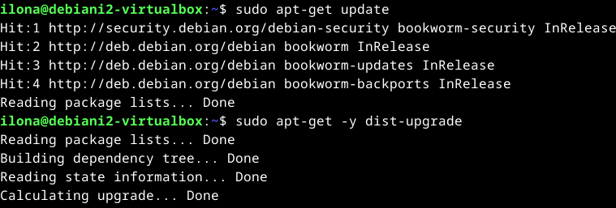

# H5 Koko juttu

Viidennessä tehtäväkokonaisuudessa kerrataan oppimaamme ja tehdään uusi tyhjä virtuaalikone. Uudella virtuaalikoneella tulee olla Apache weppipalvelin, ja sille luotu uusi etusivu. Lisäksi virtuaalikoneella tulee olla SSH-etähallintapalvelin, ja SSH-yhteydellä kirjautuminen tulee automatisoida SSH-avaimella. Tämän jälkeen viime tehtävässä vuokrattua domain-nimeä tulee tutkia `host`- ja `dig`-komennoilla sekä analysoida tulokset. Bonustehtävänä oli asentaa vagrant, ja tehdä silläkin virtuaalikone. (Karvinen 2024.)

## Uusi virtuaalikone

### Käyttöympäristö

Tietokone: Itse kasattu pöytätietokone

Prosessori: 3,70 GHz Intel Core i5-9600k

Keskusmuisti: 16 GB 3200MHz DDR4

Näytönohjain: Radeon RX 5600 XT Pulse 6GB GDDR6

Tallennustilat: C:/ 500 GB SSD M.2, D:/ 1000 GB SSD M.2

Käyttöjärjestelmä: Windows 11 Home 64-bit

### Virtuaalikoneen luominen

Aloitin tehtävien teon 20:45. Käytin apuna tässä osiossa Tero Karvisen [Install Debian on Virtualbox - Updated 2023](https://terokarvinen.com/2021/install-debian-on-virtualbox/) -artikkelia. Ensimmäiseksi avasin Virtualbox-ohjelman ja aloitin uuden virtuaalikoneen teon painikkeesta `new`. Annoin tietokoneen nimeksi Debiani2, laitoin sen tallentumaan tallennustila C:hen ja asetin sille levykuvaksi [tehtävässä 1](https://terokarvinen.com/2021/install-debian-on-virtualbox/) lataamani Debian liven. Koneen käyttöjärjestelmäksi asetin 64-bit Linux Debianin.

Asetin virtuaalikoneen käyttöön 4 GB ram-muistia ja 4 prosessorinydintä. 

Seuraavaksi siirryin Hard Disk-välilehdelle ja annoin virtuaalikoneelle massamuistia 60 GB. Jätin allokoinnin maksimikokoon pois päältä, jotta virtuaalikone vie vain sen muistin, jota se käyttää.

Tämän jälkeen virtuaalikoneen asetukset olivat valmiit ja painoin `finish`-nappia luodakseni virtuaalikoneen. Luonti sujui ongelmitta ja tässä vaiheessa kello olikin 21:03.

### Linux Debian-asennus

Aloitin tämän osion teon 21:05 ja käytin apuna tähänkin Tero Karvisen [Install Debian on Virtualbox - Updated 2023](https://terokarvinen.com/2021/install-debian-on-virtualbox/) -artikkelia. Käynnistin virtuaalikoneen painamalla `start` Virtualboxin ohjelmassa. Virtuaalikone käynnistyi ongelmitta tosin hieman hitaasti noin minuutissa. Testailin toimivuuden vierailemalla satunnaisilla verkkosivuilla, ja näppäimistö, hiiri ja näyttö toimivat odotetusti. Aloitin Debian-käyttöjärjestelmän asennuksen painamalla työpöydällä olevaa `install debian`-kuvaketta. 

Valitsin käyttöjärjestelmän kieleksi Amerikan englannin. Valitsin sijainniksi Helsingin. Asetin näppäimistöksi Suomalaisen oletusnäppäimistön. Asetin kovalevyn alustumaan kokonaan, sillä uudella virtuaalikonella ei ole vielä tietoa mitä pitäisi säilyttää. Users-välilehdellä asetin nimeksi kokon nimeni, ja käyttäjänimekseni ilona. Asetin salasanaksi tietoturvallisen salasanan salasanageneraattorilla. Nyt olin valmis käyttöjärjestelmän asetusten kanssa, ja painoin `Install`-näppäintä aloittaakseni käyttöjärjestelmän lataamisen. 

Käyttöjärjestelmän asennus käynnistyi kello 21:21. Asennus sujui ongelmitta ja valmistui kello 21:26. Käynnistin virtuaalikoneen uudelleen ja tällä kertaa se aukesikin kysyen juuri luomani käyttäjän tietoja. Testasin vielä näppäimistöä, hiirtä ja näyttöä vierailemalla satunnaisilla sivuilla ja ne toimivat odotetusti. 

### Alkutoimenpiteet ja ohjelmien asentaminen

Aloitin tämän osion tekemisen 21:35 ja käytin tähänkin apuna Tero Karvisen [Install Debian on Virtualbox - Updated 2023](https://terokarvinen.com/2021/install-debian-on-virtualbox/) -artikkelia. Ensimmäiseksi avasin terminaalin virtuaalikoneessani. Kirjoitin siihen komennon `$ sudo apt-get update` päivittääkseni ohjelmistojen pakettilistan. Terminaali kysyi salasanaani, ja tämän asetettuani se päivitti uudet paketit. Tämän jälkeen kirjoitin terminaaliin komennon `$ sudo apt-get -y dist-upgrade`, joka taas päivitti kaikki pakettilistaan tulleet päivitykset. Päivityksiä oli paljon, ja päivittelyssä menikin 21:36-21:40 välinen aika. Tein komennot uudestaan saadakseni kuvan tapahtumasta, sillä päivityksiä oli niin paljon ettei komentoja enään näkynyt. Koska olin juuri päivittänyt kaiken mahtui komennot yhteen kuvaan.

Sen jälkeen olin valmis asentamaan palomuurin. Latasin palomuuri-ohjelmiston komennolla `$ sudo apt-get -y install ufw`. Asetin sen päälle komennolla `$ sudo ufw enable`. 

Käynnistin virtuaalikoneen uudestaan ja avasin terminaalin. Testasin vielä palomuurin toimintaa komennolla `$ sudo ufw status`, ja päällä näytti olevan. 

Päätin vielä asentaa Quest Additions-ohjelman, jotta virtuaalikoneen näytön resoluutio on parempi. Menin virtuaalikoneen ylhäältä `Devices` kohtaan ja painoin "Insert Quest Additions CD image"-valintaa. Näin virtuaalikoneen levyasemaan tuli levykuva, jonka avulla pystyn asentamaan Quest Additions:in. 

Tämän jälkeen avasin terminaalin. Siirryin komennolla `$ cd /media/*/VBox*` levyn sisältöön ja tutkin sen sisältöä komennolla `$ ls`. Sieltä löytyi Linuxiin sopiva Quest Additions, ja asensin sen komennolla `$ sudo bash VBoxLinuxAdditions.run`. Kirjoitin vahingossa salasani väärin, mutta kirjoitettuani sen oikein asennus sujui ongelmitta muutamissa sekunneissa.

Käynnistin virtuaalikoneen uudestaan. Nyt pystyin suurentamaan virtuaalikoneen näyötn oman näyttöni kokoiseksi ja kopioimaan tekstiä oman tietokoneeni ja virtuaalikoneen välillä. Testasin vielä käydä satunnaisilla sivustoilla, ja nekin toimivat odotetusti. Kello oli 22:10, kun sain tämän osion päätökseen.

## Sivun luonti Apache-weppipalvelimelle

## Kirjautumisen automatisointi SSH-avaimella

## Domain-nimen tutkiminen

## Vagrant

## Lähteet

Karvinen, T. 2024. Linux Palvelimet 2024 alkukevät. Tero Karvisen verkkosivusto. Luettavissa: https://terokarvinen.com/2024/linux-palvelimet-2024-alkukevat/. Luettu: 13.02.2024.

Karvinen, T. 2023. Install Debian on Virtualbox - Updated 2023. Tero Karvisen verkkosivusto. Luettavissa: [https://terokarvinen.com/2021/install-debian-on-virtualbox/](https://terokarvinen.com/2021/install-debian-on-virtualbox/). Luettu: 25.02.2024

