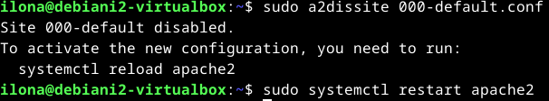

# H5 Koko juttu

Viidennessä tehtäväkokonaisuudessa kerrataan oppimaamme ja tehdään uusi tyhjä virtuaalikone. Uudella virtuaalikoneella tulee olla Apache weppipalvelin, ja sille luotu uusi etusivu. Lisäksi virtuaalikoneella tulee olla SSH-etähallintapalvelin, ja SSH-yhteydellä kirjautuminen tulee automatisoida SSH-avaimella. Tämän jälkeen viime tehtävässä vuokrattua domain-nimeä tulee tutkia `host`- ja `dig`-komennoilla sekä analysoida tulokset. (Karvinen 2024.)

## Uusi virtuaalikone

### Käyttöympäristö
Tietokone: Itse kasattu pöytätietokone

Prosessori: 3,70 GHz Intel Core i5-9600k

Keskusmuisti: 16 GB 3200MHz DDR4

Näytönohjain: Radeon RX 5600 XT Pulse 6GB GDDR6

Tallennustilat: C:/ 500 GB SSD M.2, D:/ 1000 GB SSD M.2

Käyttöjärjestelmä: Windows 11 Home 64-bit

### Virtuaalikoneen luominen

Ensimmäisenä vuorossa oli luoda uusi virtuaalikone. Aloitin tehtävän teon 20:45. Käytin apuna tässä osiossa Tero Karvisen [Install Debian on Virtualbox - Updated 2023](https://terokarvinen.com/2021/install-debian-on-virtualbox/) -artikkelia. Ensimmäiseksi avasin Virtualbox-ohjelman ja aloitin uuden virtuaalikoneen teon painikkeesta `new`. Annoin tietokoneen nimeksi Debiani2, laitoin sen tallentumaan tallennustila C:hen ja asetin sille levykuvaksi [tehtävässä 1](https://terokarvinen.com/2021/install-debian-on-virtualbox/) lataamani Debian liven. Koneen käyttöjärjestelmäksi asetin 64-bit Linux Debianin.

Asetin virtuaalikoneen käyttöön 4 GB ram-muistia ja 4 prosessorinydintä. 

Seuraavaksi siirryin Hard Disk-välilehdelle ja annoin virtuaalikoneelle massamuistia 60 GB. Jätin allokoinnin maksimikokoon pois päältä, jotta virtuaalikone vie vain sen muistin, jota se käyttää.

Tämän jälkeen virtuaalikoneen asetukset olivat valmiit ja painoin `finish`-nappia luodakseni virtuaalikoneen. Luonti sujui ongelmitta ja tässä vaiheessa kello olikin 21:03.

### Linux Debian-asennus

Aloitin tämän osion teon 21:05 ja käytin apuna tähänkin Tero Karvisen [Install Debian on Virtualbox - Updated 2023](https://terokarvinen.com/2021/install-debian-on-virtualbox/) -artikkelia. Käynnistin virtuaalikoneen painamalla `start` Virtualboxin ohjelmassa. Virtuaalikone käynnistyi ongelmitta tosin hieman hitaasti noin minuutissa. Testailin toimivuuden vierailemalla satunnaisilla verkkosivuilla, ja näppäimistö, hiiri ja näyttö toimivat odotetusti. Aloitin Debian-käyttöjärjestelmän asennuksen painamalla työpöydällä olevaa `install debian`-kuvaketta. 

Valitsin käyttöjärjestelmän kieleksi Amerikan englannin. Valitsin sijainniksi Helsingin. Asetin näppäimistöksi Suomalaisen oletusnäppäimistön. Asetin kovalevyn alustumaan kokonaan, sillä uudella virtuaalikonella ei ole vielä tietoa mitä pitäisi säilyttää. Users-välilehdellä asetin nimeksi koko nimeni, ja käyttäjänimekseni ilona. Asetin salasanaksi tietoturvallisen salasanan salasanageneraattorilla. Nyt olin valmis käyttöjärjestelmän asetusten kanssa, ja painoin `Install`-näppäintä aloittaakseni käyttöjärjestelmän lataamisen. 

Käyttöjärjestelmän asennus käynnistyi kello 21:21. Asennus sujui ongelmitta ja valmistui kello 21:26. Käynnistin virtuaalikoneen uudelleen ja tällä kertaa se aukesikin kysyen juuri luomani käyttäjän tietoja. Testasin vielä näppäimistöä, hiirtä ja näyttöä vierailemalla satunnaisilla sivuilla ja ne toimivat odotetusti. 

### Alkutoimenpiteet ja ohjelmien asentaminen

Seuraavana vuorossa oli tehdä alkutoimenpiteet ja asentaa muutama ohjelma. Aloitin tämän osion tekemisen 21:35 ja käytin tähänkin apuna Tero Karvisen [Install Debian on Virtualbox - Updated 2023](https://terokarvinen.com/2021/install-debian-on-virtualbox/) -artikkelia. Ensimmäiseksi avasin terminaalin virtuaalikoneessani. Kirjoitin siihen komennon `$ sudo apt-get update` päivittääkseni ohjelmistojen pakettilistan. Terminaali kysyi salasanaani, ja tämän asetettuani se päivitti uudet paketit. Tämän jälkeen kirjoitin terminaaliin komennon `$ sudo apt-get -y dist-upgrade`, joka taas päivitti kaikki pakettilistaan tulleet päivitykset. Päivityksiä oli paljon, ja päivittelyssä menikin 21:36-21:40 välinen aika. Tein komennot uudestaan saadakseni kuvan tapahtumasta, sillä päivityksiä oli niin paljon ettei komentoja enään näkynyt. Koska olin juuri päivittänyt kaiken mahtui komennot yhteen kuvaan.

Sen jälkeen olin valmis asentamaan palomuurin. Latasin palomuuri-ohjelmiston komennolla `$ sudo apt-get -y install ufw`. Asetin sen päälle komennolla `$ sudo ufw enable`. 

Käynnistin virtuaalikoneen uudestaan ja avasin terminaalin. Testasin vielä palomuurin toimintaa komennolla `$ sudo ufw status`, ja päällä näytti olevan. 

Päätin vielä asentaa Quest Additions-ohjelman, jotta virtuaalikoneen näytön resoluutio on parempi. Menin virtuaalikoneen ylhäältä `Devices` kohtaan ja painoin "Insert Quest Additions CD image"-valintaa. Näin virtuaalikoneen levyasemaan tuli levykuva, jonka avulla pystyn asentamaan Quest Additions:in. 

Tämän jälkeen avasin terminaalin. Siirryin komennolla `$ cd /media/*/VBox*` levyn sisältöön ja tutkin sen sisältöä komennolla `$ ls`. Sieltä löytyi Linuxiin sopiva Quest Additions, ja asensin sen komennolla `$ sudo bash VBoxLinuxAdditions.run`. Kirjoitin vahingossa salasani väärin, mutta kirjoitettuani sen oikein asennus sujui ongelmitta muutamissa sekunneissa.

Käynnistin virtuaalikoneen uudestaan. Nyt pystyin suurentamaan virtuaalikoneen näytön oman näyttöni kokoiseksi ja kopioimaan tekstiä oman tietokoneeni ja virtuaalikoneen välillä. Testasin vielä käydä satunnaisilla sivustoilla, ja nekin toimivat odotetusti. Kello oli 22:10, kun sain tämän osion päätökseen.

### Valmiin virtuaalikoneen käyttöympäristö

Tietokone: Virtualboxilla luotu virtuaalikone

Keskusmuisti: 4 GB

Massamuisti: 60 GB

Käyttöjärjestelmä: Debian 12 Bookworm (64-bit)

## Sivun luonti Apache-weppipalvelimelle

Seuraavaksi aloin luomaan sivua Apache-weppipalvelimelle. Aloitin tehtävän teon kello 19:40. Käytin tehtävässä apuna Tero Karvisen [Name Based Virtual Hosts on Apache – Multiple Websites to Single IP Address](https://terokarvinen.com/2018/04/10/name-based-virtual-hosts-on-apache-multiple-websites-to-single-ip-address/) -artikkelia. Avasin virtuaalitietokoneen ja käynnistin terminaaliohjelman. Aloitin pakettilistan päivityksellä komennolla `$ sudo apt-get update`, niin kuin edellisessäkin osiossa. Latasin Apache-weppipalvelimen komennolla `$ sudo apt-get -y install apache2`. 

Tämän jälkeen loin uuden tiedoston Apachen asetuskansioon komennolla `$ sudoedit /etc/apache2/sites-avaible/kissa.example.com.conf`. Kirjoitin tiedoston sisällön kuvassa näkyvällä syntaksilla ja tallensin tiedoston.

Otin sivuston käyttöön komennolla `$ sudo a2ensite kissa.example.com`. Tämän jälkeen käynnistin Apachen uudestaan komennolla `$ sudo systemctl restart apache2`. 

Kokeilin vierailla osoitteessa http://localhost/ selaimella, mutta huomasin, että se yhä näyttää Apachen oletussivua. Korjasin asian ottamalla pois käytöstä Apachen oletussivun komennolla `sudo a2dissite 000-default.conf` ja käynnistin Apachen taas uudelleen komennolla `$ sudo systemctl restart apache2`. Tämän jälkeen sain toivomani virheilmoituksen selaimeen, jonka tiesin johtuvan siitä, etten ole luonut index-tiedostoa kissa.example-sivustolle.

Tämän jälkeen loin kansion, jonka olin asettanut juuri kissa.example-sivun asetustiedostoon poluksi. Tein sen komennolla `$ mkdir -p /home/ilona/publicsites/kissa.example.com`. Tämän jälkeen loin vielä etusivun kyseiseen kansioon komennolla `$ micro /home/ilona/publicsites/kissa.example.com/index.html`. Kirjoitin sivun sisällöksi lyhyen testitekstin. 

Kokeilin vielä kerran mennä osoitteeseen http://localhost/ selaimella, ja tällä kertaa sivusto näytti kirjoittamani tekstin. Kello oli 20:14, kun sain tehtävän valmiiksi.

## Kirjautumisen automatisointi SSH-avaimella

Seuraavaksi tuli kirjautuminen automatisoida SSH-avaimella. Päätin automatisoida kirjautumisen [viime tehtävässä](https://github.com/Ilona-Hiltunen/linux-course2024/blob/main/h4_maailma_kuulee.md) luomalleni virtuaalipalvelimelle. Käytin tehtävässä apuna Debian Wikin [SSH-tietosivua](https://wiki.debian.org/SSH). Asensin SSH-etähallintapalvelimen komennolla `sudo apt-get install openssh-server`. 

Seuraavaksi loin SSH-yhteyden DigitalOceanin virtuaalipalvelimelle komennolla `$ ssh ilona@134.209.202.182`. Terminaali kysyi salasanaani, ja sen asetettuani pääsin kirjautumaan harjoituspalvelimeksi nimeämälleni virtuaalipalvelimelle. Jätin yhteyden auki terminaaliin siltä varalta, että en pääsisi enään kirjautumaan sinne takaisin SSH-avainta luodessani.

Avasin uuden terminaalin ja loin SSH-avaimen komennolla `$ ssh-keygen` virtuaalikoneellani. Terminaali kysyi mihin kansioon avain talletetaan, ja päätin tallentaa sen oletuskansioon. Tarvittava kansio avaimelle luotiin automaattisesti. Tämän jälkeen pystyi asettamaan salasanan SSH-avaimelle. Sen asettamisen jälkeen SSH-avain oli luotu.

Tämän jälkeen kopion SSH-avaimen virtuaapalvelimelleni komennolla `$ ssh-copy-id ilona@134.209.202.182`. Terminaali kysyi virtuaalipalvelimeni salasanaa, ja asetettuani sen onnistuneesti palvelin ilmoitti, että avain on lisätty ja voin kokeilla kirjautumista SSH-avaimella.

Tämän jälkeen kokeilin kirjautumista virtuaalikoneeltani virtuaalipalvelimelleni komennolla `$ ssh ilona@134.209.202.182`. Pääsin kirjautumaan virtuaalipalvelimelleni automaattisesti, eikä salasanaa kysytty, joten päättelin SSH-avaimen asennuksen onnistuneen. Kello oli 22:20, kun sain tehtävän päätökseen.

## Domain-nimen tutkiminen

Viimeisenä tehtävänä tuli tutkia [[viime tehtävän](https://github.com/Ilona-Hiltunen/linux-course2024/blob/main/h4_maailma_kuulee.md) domain-nimeä `host` ja `dig` komennoilla ja verrata tietoja nimen vuokraajan tietoihin. Vuokraaja oli tapauksessani [NameCheap](https://www.namecheap.com/). Aloitin tehtävän teon 22:45. Käytin tehtävässä apuna Tero Karvisen [tehtävänantoon H5 kirjoittamia vinkkejä](https://terokarvinen.com/2024/linux-palvelimet-2024-alkukevat/). Kokeilin ensin `host`-komentoa, ja huomasin, että komentoa ei löydy eli sitä ei ole asennettu. Asensin komennot kirjoittamalla terminaaliin `$ sudo apt-get -y install bind9-dnsutils bind9-host`. 

Kokeilin ensimmäistä komentoa kirjoittamalla terminaaliin `host ilonahiltunen.com`. Se palautti sivuston IP-osoitteen, joka oli sama, jonka olin asettanut NameCheap-sivustolle domain-nimeni osoitteeksi.

Tämän jälkeen kokeilin seuraavaa komentoa kirjoittamalla terminaaliin `dig ilonahiltunen.com`. Tämä komento palautti pidemmän tekstin, kuin äskeinen. Käytin apuna vastauksen tulkitsemiseen Linux Handbookin artikkelia [Dig Command in Linux Explained](https://linuxhandbook.com/dig-command/). Ensimmäinen rivi tarkoittaa, mistä laitteesta pyyntö on tehty ja mihin se on tehty. Seuraavaksi ilmoitetaan vastaus, joka pyynnön kohteena ollut sivusto palautti. Tässä tapauksessa saimme vastauksena sivuston IP-osoitteen, eikä pyynnön onnistumisessa ilmennyt virheitä. Viimeisenä on tietoa pyynnöstä, kuten siihen kulunut aika, mistä pyyntö on tehty ja milloin pyyntö tehtiin. Tämänkin komennon vastauksessa yhteneväistä Namecheapin sivustolle oli asettamani domain-nimen IP-osoite.

Viimeinen tehtävä valmistui 23:05.

## Lähteet

Debian Wiki. 09.11.2023. SSH. Debian Wiki. Luettavissa: [https://wiki.debian.org/SSH](https://wiki.debian.org/SSH). Luettu: 26.02.2024.

Karvinen, T. 2024. Linux Palvelimet 2024 alkukevät. Tero Karvisen verkkosivusto. Luettavissa: https://terokarvinen.com/2024/linux-palvelimet-2024-alkukevat/. Luettu: 13.02.2024.

Karvinen, T. 10.04.2018. Name Based Virtual Hosts on Apache – Multiple Websites to Single IP Address. Luettavissa: [https://terokarvinen.com/2018/04/10/name-based-virtual-hosts-on-apache-multiple-websites-to-single-ip-address/](https://terokarvinen.com/2018/04/10/name-based-virtual-hosts-on-apache-multiple-websites-to-single-ip-address/). Luettu: 26.02.2024.

Karvinen, T. 2023. Install Debian on Virtualbox - Updated 2023. Tero Karvisen verkkosivusto. Luettavissa: [https://terokarvinen.com/2021/install-debian-on-virtualbox/](https://terokarvinen.com/2021/install-debian-on-virtualbox/). Luettu: 25.02.2024

Linux Handbook. s.a. Dig Command in Linux Explained. Linux Handbook. Luettavissa: [https://linuxhandbook.com/dig-command/](https://linuxhandbook.com/dig-command/). Luettu: 26.02.2024.

