# H6 DJ Ango

Kurssin kuudennessa osiossa ensimmäiseksi tuli tehdä lyhyet tiivistelmät Tero Karvisen artikkeleista [Django 4 Instant Customer Database Tutorial](https://terokarvinen.com/2022/django-instant-crm-tutorial/) ja [Deploy Django 4 - Production Install](https://terokarvinen.com/2022/deploy-django/). Tämän jälkeen virtuaalikoneelle tuli tehdä yksinkertainen ohjelma Djangolla ja Djangon tuotantotyyppinen asennus. (Karvinen 2024.)

## Tiivistelmät

### Django 4 Instant Customer Database Tutorial

- Djangon viimeisimmän version asentamisessa tulee käyttää `pip`-komentoa ja se tulisi tehdä `virtualenv`-tilassa, jotta kaikki paketit tallentuvat samaan kansioon. `Pip`-komennon käytössä tulee olla varovainen oikeinkirjoituksessa, jotta ei vahingossa asenna väärää ohjelmaa.
- Django-projektin voi aloittaa komennolla `$ django-admin startproject projektinnimi` ja testiserverin voi käynnistää komennolla `$ ./manage.py runserver`.
- Tietokannat voi päivittää komennolla `$ ./manage.py makemigrations` ja sen jälkeen `$ ./manage.py migrate`. 
- Käyttäjän voi tehdä komennolla `$ ./manage.py createsuperuser`.
- Uuden ohjelman projektiin voi tehdä komennolla `$ ./manage.py startapp ohjelmannimi`. Tero Karvisen esimerkissä on tehty CRM-ohjelma. Ohjelma tulee lisätä `settings.py`-tiedostoon `INSTALLED_APPS`-kohtaan.
- Uusi luokka tehdään `models.py`-tiedostoon, josta Django osaa tehdä automaattisesti tietokannan. Tero Karvisen esimerkissä tiedostoon on tehty asiakas-luokka, jolla on attribuuttina asiakkaan nimi. Tämän jälkeen tietokannat tulee päivittää.
- Viimeisenä vielä luokka tulee rekisteröidä `admins.py`-tiedostoon. Sen voi tehdä muokkaamalla `admins.py`-tiedostoa lisäämällä siihen `admin.site.register(models.LuokanNimi)`.
- Nyt luodun tietokannan pitäisi näkyä osoitteessa  http://127.0.0.1:8000/admin/.

(Karvinen 2021. b.)

### Deploy Django 4 - Production Install

- Tuotantokäyttöiseen Djangoon tulee asentaa Apache-weppipalvelin. Sen voi asentaa komennolla `$ sudo apt-get -y install apache2.` Apachen toimintaa voi testata tekemällä `static`-kansion ja tekemällä sille `index.html`-tiedoston. Esimerkissä hakemistopolku tiedostolle on `publicwsgi/teroco/static/`. Virtualhost tulee laittaa osoittamaan tähän osoitteeseen, jotta sisältö näkyy.
- Djangon nimi olisi hyvä tehdä `requirements.txt`-tiedostoon, jotta se tulee varmasti kirjoitettua oikein ja oikea ohjelma tulee ladattua. Tämän jälkeen Djangon voi asentaa `virtualenv`-tilassa komennolla `$ pip install -r requirements.txt`. Uuden projektin voi tehdä komennolla `$ django-admin startproject projektinnimi`.
- Seuraavaksi Apache tulisi konfiguroida Python-ohjelmille sopivaksi. Tämän voi tehdä muokkaamalla Apachen conf-tiedostoa, joka Tero Karvisen esimerkissä tehdään komennolla `$ sudoedit /etc/apache2/sites-available/teroco.conf`. Jotta Apache ymmärtää tiedostoon tehtyjä WSGI-komentoja, tulee WSGI-moduuli asentaa komennolla `$ sudo apt-get -y install libapache2-mod-wsgi-py3`.
- Jotta sivusto olisi tietoturvallinen, tulee `DEBUG` ottaa pois käytöstä. Sen voi tehdä muokkaamalla projektikansion alla olevaa `settings.py`-tiedostoa. Samaan tiedostoon kirjoitetaan hostin nimi `ALLOWED_HOSTS`-kohtaan. Muutokset voi päivittää Apachelle komennolla `$ touch projektikansio/wsgi.py`.
- Tämän jälkeen sivuston tulisi toimia määritellystä host-osoitteesta.

(Karvinen 2021. a.)

## Käyttöympäristö

Tietokone: Virtualboxilla luotu virtuaalikone

Keskusmuisti: 4 GB

Massamuisti: 60 GB

Käyttöjärjestelmä: Debian 12 Bookworm (64-bit)

## Yksinkertainen esimerkkiohjelma Djangolla

Käytin tehtävässä apuna Tero Karvisen [Django 4 Instant Customer Database Tutorial](https://terokarvinen.com/2022/django-instant-crm-tutorial/) -artikkelia, ja päätin tehdä samanlaisen CRM-ohjelman. Aloitin tehtävien teon 22:00. Ensimmäiseksi tein django-nimisen kansion, johon aion laittaa projektin ja muut tiedostot komennolla `$ mkdir django`. Tämän jälkeen siirryin kyseiseen kansioon ja tein sinne env-kansion komennolla `$ $ virtualenv --system-site-packages -p python3 env/`. Tämän jälkeen laitoin virtualenv-tilan päälle komennolla `$ source env/bin/activate`.

Tämän jälkeen tein requirements.txt-tiedoston komennolla `$ micro requirements.txt`, jonka sisälloksi kirjoitin ladattavan Djangon. Päätin käyttää versiota 4, sillä sitä oli käytetty ohjeistuksessa. Tämän jälkeen aloitin Djangon latauksen komennolla `$ pip install -r requirements.txt`.

Nyt olin valmis luomaan projektin, ja tein sen komennolla `$ django-admin startproject kissala`. Testasin vielä sivuston toiminnan siirtymällä kissala-projektikansioon ja käynnistämällä projektin komennolla `$ ./manage.py runserver`. Menin terminaaliin palauttamaan http://127.0.0.1:8000/ -osoitteeseen ja sain näkyviin Djangon testisivun.

Tämän jälkeen päivitin tietokannan komennoilla `$ ./manage.py makemigrations` ja sen jälkeen `./manage.py migrate`. 

Tämän jälkeen tein käyttäjän sivustolle komennolla `$ ./manage.py createsuperuser`, jonka nimeksi asetin ilona ja tein tietoturvallisen salasanan salasanageneraattorillani. Tämän jälkeen testasin kirjautua tekemilläni tunnuksilla osoitteeseen  http://127.0.0.1:8000/admin/, ja kirjautuminen onnistui.

Tämän jälkeen aloin luomaan CRM-ohjelmaa. Loin kansion ohjelmalle komennolla `$ ./manage.py startapp crm`. Muokkasin settings.py-tiedostoa komennolla `$ micro kissala/settings.py`. Lisäsin sinne INSTALLED_APPS kohtaan crm-kansion kuvan mukaisesti.

Seuraavaksi loin asiakas-luokan, jolla oli attribuuttina asiakkaan nimi. Tein luokan models.py-tiedostoon komennolla `$ micro crm/models.py`. Kirjoitin luokan sisällön kuvan mukaisesti, jossa luokan nimeksi annetaan Customer, attribuutiksi nimi ja alempana määritellään, että asiakas näkyy nimellänsä tietokannassa.

Tämän jälkeen päivitin taas tietokannan komennoilla `$ ./manage.py makemigrations` ja sen jälkeen `./manage.py migrate`. Tämän jälkeen vielä rekisteröin luokan admin.py-tiedostoon komennolla `$ micro crm/admin.py`. Muokkasin tiedostoa kuvan mukaisella tavalla.

Viimeiseksi käynnistin testiserverin komennolla `$ ./manage.py runserver`. Menin osoitteeseen http://127.0.0.1:8000/admin/ ja kokeilin lisätä ja poistaa asiakkaita. Tämä onnistui ja ohjelma oli valmis klo 22:50.

## Djangon tuotantotyyppinen asennus

Käytin tässä tehtävässä ohjeena Tero Karvisen [Deploy Django 4 - Production Install](https://terokarvinen.com/2022/deploy-django/) -artikkelia. Aloitin tehtävän teon 23:15. Aloitin tehtävän tekemisen luomalla publicwsgi-, ilohi- ja static-kansion komennolla `$ mkdir -p publicwsgi/ilohi/static`. Tein static-kansioon index-tiedoston komennolla `$ micro publicwsgi/ilohi/static/index.html` ja kirjoitin sisällöksi lyhyen testitekstin. Sitten loin uuden virtualhost-tiedoston komennolla `$ sudoedit /etc/apache2/sites-available/ilohi.conf`, ja kirjoitin sen sisällön kuvan mukaisesti.

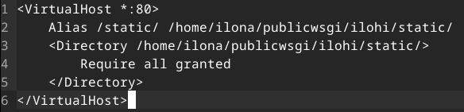

Tämän jälkeen otin käyttöön tekemäni sivun komennolla `$ sudo a2ensite ilohi.conf` ja poistin vanhan käytössä olevan sivun komennolla `$ sudo a2dissite kissa.example.com.conf`. Tämän jälkeen käynnistin Apachen uudestaan komennolla `$ sudo systemctl restart apache2`. Testasin sivuston näkymistä komennolla `$ curl http://localhost/static/`, ja se palautti kirjoittamani testitekstin.

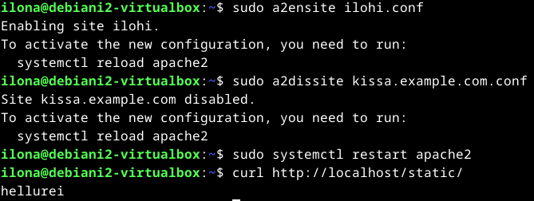

Siirryin publicwsgi-kansioon ja tein sinne env-kansion ladattaville paketeille komennolla `$ virtualenv -p python3 --system-site-packages env`. Otin virtualenv-tilan käyttöön komennolla `$ virtualenv -p python3 --system-site-packages env`. Tarkistin vielä komennolla `$ which pip`, että lataukset todellakin menevät env-kansioon.

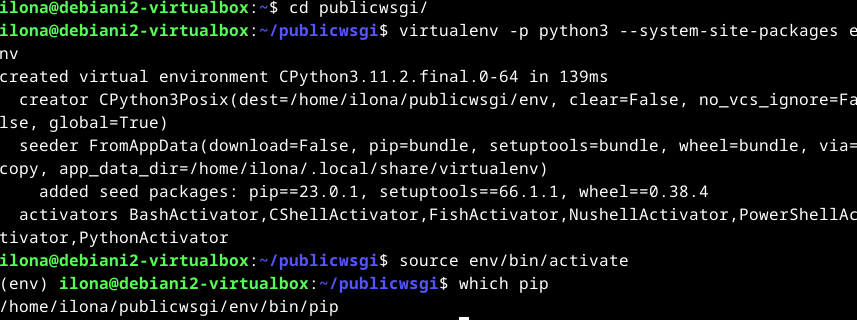

Seuraavaksi kopioin edellisessä tehtävässä tekemäni requirements.txt-tiedoston tähän kansioon komennolla `cp /home/ilona/django/requirements.txt requirements.txt` ja tarkistin, että tiedosto on varmasti oikea komennolla `$ cat requirements.txt`. Tämän jälkeen asensin Djangon komennolla `$ pip install -r requirements.txt` ja tarkistin, että minulla on Djangon 4. versio komennolla `$ django-admin --version`.

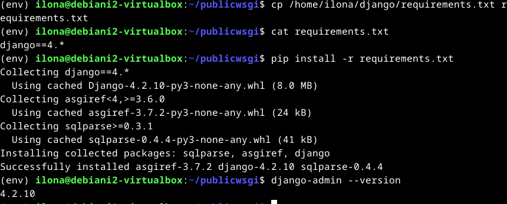

Poistin tekemäni testikansion komennolla `$ rm -r ilohi`. Tämän jälkeen loin ilohi-nimisen Django-projektin komennolla `$ django-admin startproject ilohi`.

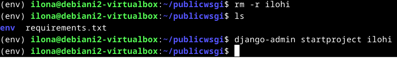

Siirryin muokkaamaan Apachen ilohi.conf-tiedostoa komennolla `$ sudoedit /etc/apache2/sites-available/ilohi.conf`. Asetin tiedoston sisällön kuvan mukaisesti.

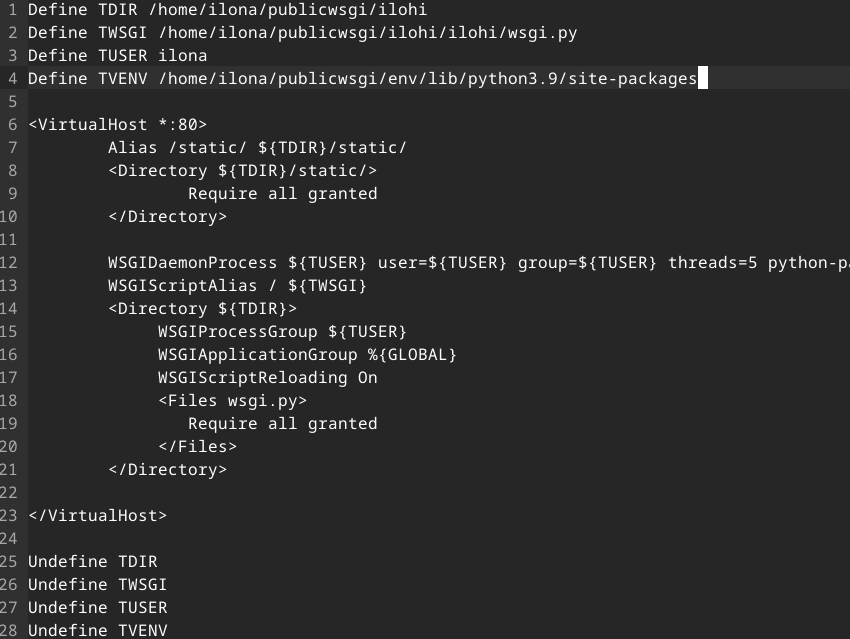

Tämän jälkeen asensin WSGI-moduulin komennolla `$ sudo apt-get -y install libapache2-mod-wsgi-py3`, jotta Apache osaa lukea ilohi.conf-tiedostoon asetettuja WSGI-komentoja. Tämän jälkeen vielä testasin syntaksin komennolla `$ /sbin/apache2ctl configtest` ja terminaali palautti, että se on kunnossa. Lopuksi vielä käynnistin Apachen uudelleen komennolla `$ sudo systemctl restart apache2`.

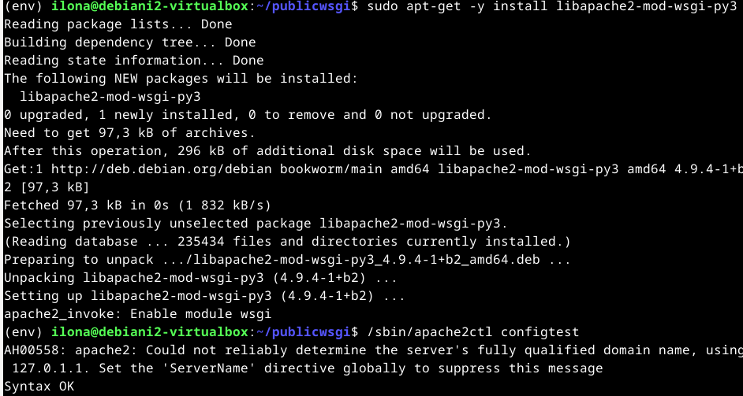

Tämän jälkeen kokeilin sivuston toimintaa komennolla `$ curl -s localhost|grep title`, ja komento palautti tekstin, että sivusto toimii. Kokeilin myös, että yhteys otetaan Apacheen eikä testiserveriin komennolla `$ curl -sI localhost|grep Server`. Terminaali vahvisti, pyyntöön vastaa Apache.

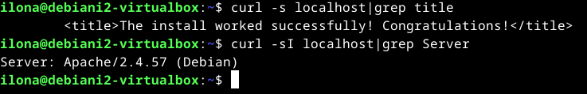

Seuraavaksi otin DEBUG-asetuksen pois päältä ja lisäsin sallittuihin hosteihin localhostin. Muokkasin settings.py-tiedostoa komennolla `$ micro ilohi/ilohi/settings.py`. Laitoin siihen kuvassa näkyvät tiedot. Käynnistin Apachen uudelleen komennolla `$ sudo systemctl restart apache2`, jotta asetukset päivittyy.

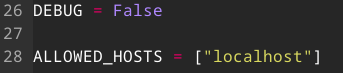

Nyt kokeilin komentoa `$ curl -s localhost|grep title` uudestaan. Sain vastaukseksi, että mitään ei löydy. Se oli odotettavissa, sillä etusivulle ei ole määritelty mitään sisältöä. Kokeilin vielä mennä selaimessa osoitteeseen http://localhost/admin. Näkyville tuli ruma kirjautumissivu, mikä johtui siitä että siinä ei ole CSS-muotoilua. Sain kuitenkin vahvistuksen siitä, että sivusto toimii haluamallani tavalla. Tehtävä valmistui 01:00.

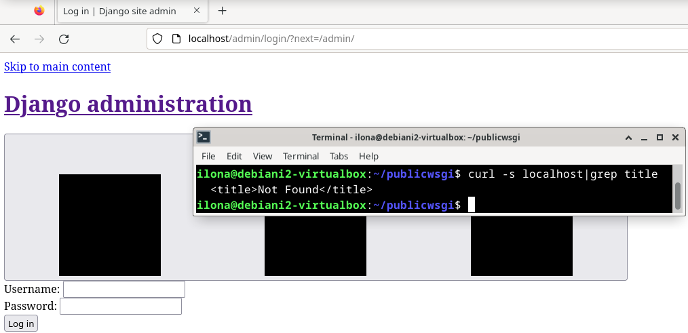

Lisäsin vielä muotoilun sivustolle muokkaamalla settings-tiedostoa komennolla `$ micro ilohi/ilohi/settings.py`. Lisäsin tiedoston alkuun "import os" ja sisältöön "STATIC_ROOT = os.path.join(BASE_DIR, 'static/')". Tämän jälkeen vielä tein komennon `$ ilohi/manage.py collectstatic`. Tämän jälkeen muotoilu näkyi http://localhost/admin -osoitteessa. Lisäaikaa tähän meni 10 minuuttia. 

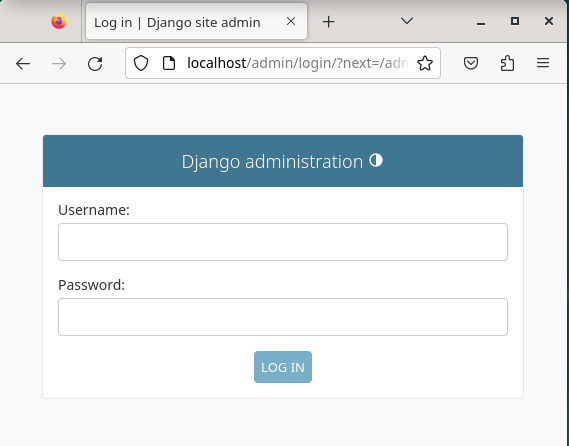

## Lähteet

Karvinen, T. 2021. a. Deploy Django 4 - Production Install. Tero Karvisen verkkosivusto. Luettavissa: [https://terokarvinen.com/2022/deploy-django/](https://terokarvinen.com/2022/deploy-django/). Luettu: 27.02.2024.

Karvinen, T. 2021. b. Django 4 Instant Customer Database Tutorial. Tero Karvisen verkkosivusto. Luettavissa: [https://terokarvinen.com/2022/django-instant-crm-tutorial/](https://terokarvinen.com/2022/django-instant-crm-tutorial/). Luettu: 27.02.2024.

Karvinen, T. 2024. Linux Palvelimet 2024 alkukevät. Tehtävänanto H6 AJ Ango. Tero Karvisen verkkosivusto. Luettavissa: [https://terokarvinen.com/2024/linux-palvelimet-2024-alkukevat/](https://terokarvinen.com/2024/linux-palvelimet-2024-alkukevat/). Luettu: 27.02.2024.
