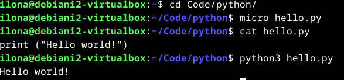
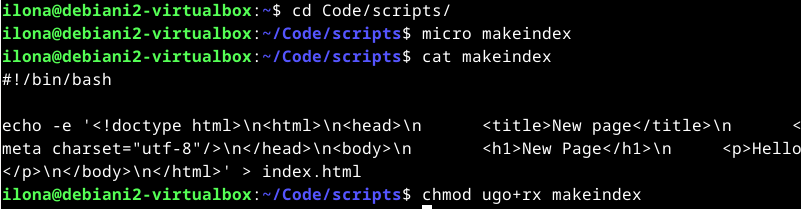
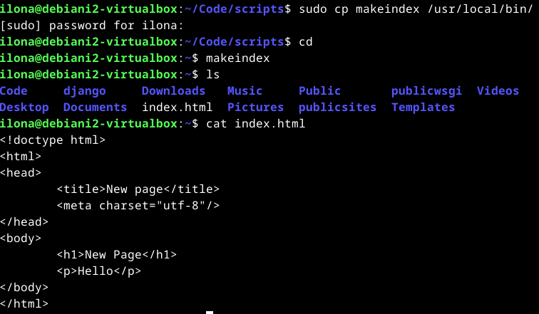

# H7 Maalisuora

Seitsemännessä tehtävässä tuli ensimmäisenä kääntää "Hei maailma" haluamalleen kielelle, ja sen jälkeen asentaa Linuxiin uusi komento niin, että kaikki käyttäjät voivat ajaa sitä. Tämän jälkeen tuli toistaa jokin edellisten kurssien laboratorioharjoituksista. Viimeisenä tuli luoda uusi tyhjä virtuaalikone seuraavan viikon lopputehtävää varten. (Karvinen 2024.)

## Käyttöympäristö 

Tietokone: Virtualboxilla luotu virtuaalikone

Keskusmuisti: 4 GB

Massamuisti: 60 GB

Käyttöjärjestelmä: Debian 12 Bookworm (64-bit)

## Kääntäminen ja uuden komennon tekeminen

### Hello World kääntäminen Pythonille

Käytin tässä tehtävässä apuna Tero Karvisen [Hello World Python3, Bash, C, C++, Go, Lua, Ruby, Java – Programming Languages on Ubuntu 18.04](https://terokarvinen.com/2018/hello-python3-bash-c-c-go-lua-ruby-java-programming-languages-on-ubuntu-18-04/?fromSearch=hello%20world) -artikkelia. Aloitin tehtävän teon 18:20. Siirryin haluamaani kansioon komennolla `$ cd Code/python/`. Loin uuden Python-tiedoston komennolla `$ micro hello.py`. Loin tiedoston sisällöksi kuvan `$ cat hello.py`-komennon alla näkyvän koodin. Testasin sen suorittamista komennolla `$ python3 hello.py`, ja se palautti kirjoittamani tekstin. Tehtävä valmistui 18:24.

### Komennon tekeminen kaikille käyttäjille

Seuraavaksi vuorossa oli tehdä komento, jonka kaikki käyttäjät voi suorittaa. Käytin tehtävässä apuna Tero Karvisen [Shell Scripting](https://terokarvinen.com/2007/shell-scripting-4/#hello_world_-_lspwd) -artikkelia. Päätin tehdä komennon, joka luo automaattisesti index.html-tiedoston oikealla syntaksilla. Aloitin tehtävän teon 18:30. Siirryin haluamaani kansioon komennolla `$ cd Code/scripts/`. Tämän jälkeen loin uuden tiedoston komennolla `$ micro makeindex`. Kirjoitin tiedoston sisällön kuvan mukaisesti. Annoin kaikille käyttäjille suoritus- ja lukuoikeudet komennolla `$ chmod ugo+rx makeindex`. 

Tämän jälkeen kopioin tiedoston /usr/local/bin/-hakemistoon pääkäyttäjänä komennolla `$ sudo cp makeindex /usr/local/bin`. Siirryin kotihakemistooni komennolla `$ cd`, jotta voin testata ohjelman suoritusta niin, ettei se vahingossa lue Code/scripts/-hakemistooni luomaa tiedostoa. Nyt terminaaliin piti kirjoittaa komennoksi vain `$ makeindex`, ja kuten kuvasta näkyy hakemistoon ilmestyi validi index.html-tiedosto. Tehtävä oli valmis 19:00.

## Laboratorioharjoitus

Päätin suorittaa Tero Karvisen opettaman [Linux palvelimet 2023](https://terokarvinen.com/2023/linux-palvelimet-2023-arvioitava-laboratorioharjoitus/)-kurssin loppuharjoituksen. Loin ensimmäiseksi uuden virtuaalikoneen, jotta voin toteuttaa tehtävän samoissa olosuhteissa, kuin tulevankin laboratorioharjoituksen. Virtuaalikone on käyttöympäristöltään täysin samanlainen, kuin raportin alussa kuvaamani virtuaalikone. 

# Lähteet

Karvinen, T. 2023. Final Lab for Linux Palvelimet 2023. Tero Karvisen verkkosivusto. Luettavissa: [https://terokarvinen.com/2023/linux-palvelimet-2023-arvioitava-laboratorioharjoitus/](https://terokarvinen.com/2023/linux-palvelimet-2023-arvioitava-laboratorioharjoitus/). Luettu: 05.03.2024.

Karvinen, T. 27.09.2018. Hello World Python3, Bash, C, C++, Go, Lua, Ruby, Java – Programming Languages on Ubuntu 18.04. Tero Karvisen verkkosivusto. Luettavissa: [https://terokarvinen.com/2018/hello-python3-bash-c-c-go-lua-ruby-java-programming-languages-on-ubuntu-18-04/?fromSearch=hello%20world](https://terokarvinen.com/2018/hello-python3-bash-c-c-go-lua-ruby-java-programming-languages-on-ubuntu-18-04/?fromSearch=hello%20world). Luettu: 05.03.2024.

Karvinen, T. 2024. Linux Palvelimet 2024 alkukevät. Tehtävänanto H7 Maalisuora. Tero Karvisen verkkosivusto. Luettavissa: [https://terokarvinen.com/2024/linux-palvelimet-2024-alkukevat/](https://terokarvinen.com/2024/linux-palvelimet-2024-alkukevat/). Luettu: 05.03.2024.

Karvinen, T. 04.12.2007. Shell Scripting. Tero Karvisen verkkosivusto. Luettavissa: [https://terokarvinen.com/2007/shell-scripting-4/#see_also](https://terokarvinen.com/2007/shell-scripting-4/#see_also). Luettu: 05.03.2024.
