# H7 Maalisuora

Seitsemännessä tehtävässä tuli ensimmäisenä kääntää "Hei maailma" haluamalleen kielelle, ja sen jälkeen asentaa Linuxiin uusi komento niin, että kaikki käyttäjät voivat ajaa sitä. Tämän jälkeen tuli toistaa jokin edellisten kurssien laboratorioharjoituksista. Viimeisenä tuli luoda uusi tyhjä virtuaalikone seuraavan viikon lopputehtävää varten. (Karvinen 2024.)

## Käyttöympäristö 

Tietokone: Virtualboxilla luotu virtuaalikone

Keskusmuisti: 4 GB

Massamuisti: 60 GB

Käyttöjärjestelmä: Debian 12 Bookworm (64-bit)

## Kääntäminen ja uuden komennon tekeminen

### Hello World kääntäminen Pythonille

Käytin tässä tehtävässä apuna Tero Karvisen [Hello World Python3, Bash, C, C++, Go, Lua, Ruby, Java – Programming Languages on Ubuntu 18.04](https://terokarvinen.com/2018/hello-python3-bash-c-c-go-lua-ruby-java-programming-languages-on-ubuntu-18-04/?fromSearch=hello%20world) -artikkelia. Aloitin tehtävän teon 18:20. Siirryin haluamaani kansioon komennolla `$ cd Code/python/`. Loin uuden Python-tiedoston komennolla `$ micro hello.py`. Loin tiedoston sisällöksi kuvan `$ cat hello.py`-komennon alla näkyvän koodin. Testasin sen suorittamista komennolla `$ python3 hello.py`, ja se palautti kirjoittamani tekstin. Tehtävä valmistui 18:24.

### Komennon tekeminen kaikille käyttäjille

Seuraavaksi vuorossa oli tehdä komento, jonka kaikki käyttäjät voi suorittaa. Käytin tehtävässä apuna Tero Karvisen [Shell Scripting](https://terokarvinen.com/2007/shell-scripting-4/#hello_world_-_lspwd) -artikkelia. Päätin tehdä komennon, joka luo automaattisesti index.html-tiedoston oikealla syntaksilla. Aloitin tehtävän teon 18:30. Siirryin haluamaani kansioon komennolla `$ cd Code/scripts/`. Tämän jälkeen loin uuden tiedoston komennolla `$ micro makeindex`. Kirjoitin tiedoston sisällön kuvan mukaisesti. Annoin kaikille käyttäjille suoritus- ja lukuoikeudet komennolla `$ chmod ugo+rx makeindex`. 

Tämän jälkeen kopioin tiedoston /usr/local/bin/-hakemistoon pääkäyttäjänä komennolla `$ sudo cp makeindex /usr/local/bin`. Siirryin kotihakemistooni komennolla `$ cd`, jotta voin testata ohjelman suoritusta niin, ettei se vahingossa lue Code/scripts/-hakemistooni luomaa tiedostoa. Nyt terminaaliin piti kirjoittaa komennoksi vain `$ makeindex`, ja kuten kuvasta näkyy hakemistoon ilmestyi validi index.html-tiedosto. Tehtävä oli valmis 19:00.

## Laboratorioharjoitus

Päätin suorittaa Tero Karvisen opettaman [Linux palvelimet 2023](https://terokarvinen.com/2023/linux-palvelimet-2023-arvioitava-laboratorioharjoitus/)-kurssin loppuharjoituksen. Jätin loppuharjoituksesta a) ja b) -kohdat tekemättä, jotka liittyivät raportin kirjoittamiseen, sillä kirjoitan tehtävistä raportin tähän tiedostoon. Loin ensimmäiseksi uuden virtuaalikoneen, jotta voin toteuttaa tehtävän samoissa olosuhteissa, kuin tulevankin laboratorioharjoituksen. Virtuaalikone on käyttöympäristöltään täysin samanlainen, kuin raportin alussa kuvaamani virtuaalikone. 

### Tiedoston suojaaminen

Ensimmäinen tehtvä oli suojata tiedosto niin, että ainoastaan käyttäjäni voi katsoa sitä (Karvinen 2023). Aloitin tehtävän teon 16:19. Loin testitiedoston komennolla `$ nano testi.txt`. Tämän jälkeen tarkastelin tiedoston oikeuksia komennolla `$ ls -l testi.txt`, ja huomasin että ryhmä ja muut saavat lukea tiedostoa. Poistin ryhmältä ja muilta käyttäjiltä lukuoikeuden komennolla `$ chmod go-r testi.txt`. Nyt tarkastelin uudestaan tiedoston oikeuksia, ja ainoastaan käyttäjälläni oli oikeus lukea tiedosto. Tehtävä oli valmis 16:22.

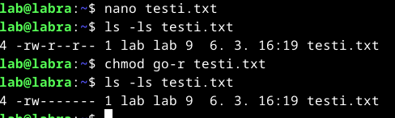

### Komennon tekeminen

Seuraavaksi tuli tehdä "hey"-niminen komento, joka tulostaa jotain ajankohtaista tietoa (Karvinen 2023). Käytin tehtävässä apuna Tero Karvisen [Shell Scripting](https://terokarvinen.com/2007/shell-scripting-4/#hello_world_-_lspwd) -artikkelia. Aloitin tehtävän tekemisen 16:50. Tein uuden kansion komennolla `$ mkdir scripts`, ja siirryin siihen komennolla `$ cd scripts/`. Tein uuden tiedoston komennolla `$ nano hey`, ja kirjoitin sen sisällön kuvan mukaisesti.

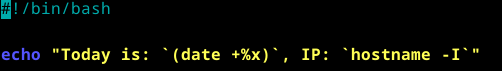

Annoin kaikille oikeudet lukea ja suorittaa tiedostoa komennolla `$ chmod ugo+rx hey` Kopioin vielä tiedoston paikallisesta hakemistostani /usr/local/bin-hakemistoon komennolla `$ sudo cp hey /usr/local/bin`. Siirryin kotihakemistooni ja kokeilin kirjoittaa komennoksi `$ hey`. Terminaali palautti vastaukseksi päivämäärän ja virtuaalikoneen ip-osoitteen. Tehtävä oli valmis 17:00.

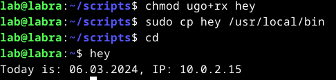

### Micron asennus

Seuraavaksi tuli asentaa Micro-editori ja sille joku plugin (Karvinen 2023). Aloitin tehtävän 17:05. Ensimmäisenä päivitin pakettilistan komennolla `$ sudo apt-get update` ja sen jälkeen asensin Micron komennolla `$ sudo apt-get install micro`.

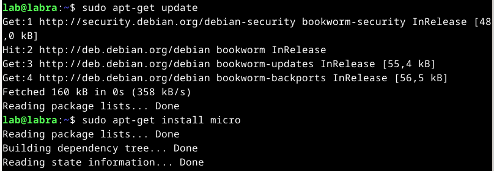

Tämän jälkeen tutkin plugineja, ja päätin ottaa käyttöön Tero Karvisen [Micro-jump](https://github.com/terokarvinen/micro-jump)-pluginin, jossa voi hyppiä editorissa eri komentoihin. Käytin ohjeena ohjelman Github-sivua. Asensin pluginiin tarvittavat ohjelmat komennolla `$ sudo apt-get -y install fzf exuberant-ctags`. Tämän jälkeen asensin plugin komennolla `$ micro --plugin install jump`.

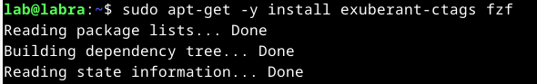 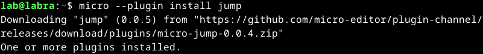

Tein uuden testitiedoston komennolla `$ micro testi.py`. Laitoin muutaman funktion tiedostoon, ja tallensin tiedoston painamalla CTRL+S. Tämän jälkeen painoin F4, ja tästä avautui näkymä, jossa voin valita mihin funktioon haluan hypätä. Tehtävä oli valmis 17:25.

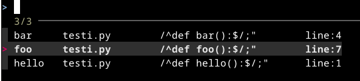

### Apache

Tämän jälkeen tuli asentaa Apache-weppipalvelin, tehdä uusi Erkki-niminen käyttäjä ja tehdä Erkille kotisivu (Karvinen 2024). Käytin tehtävässä ohjeena Tero Karvisen [Name Based Virtual Hosts on Apache – Multiple Websites to Single IP Address](https://terokarvinen.com/2018/name-based-virtual-hosts-on-apache-multiple-websites-to-single-ip-address/?fromSearch=apache) -artikkelia. Aloitin tehtävän kello 18:50. Ensimmäisenä asensin Apachen komennolla `$ sudo apt-get -y install apache2`. Tämän jälkeen loin Erkille käyttäjän komennolla `$ sudo adduser erkki`.

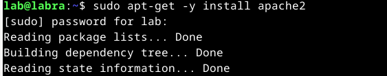 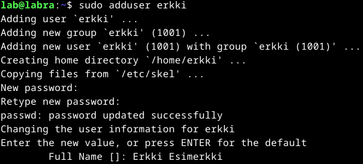

Seuraavaksi loin uuden tiedoston komennolla `$ sudoedit /etc/apache2/sites-available/homepage.example.com.conf`. Asetin sen sisällön kuvan mukaisesti.

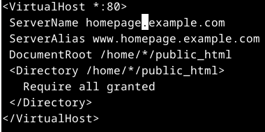

Otin sivun käyttöön komennolla `$ sudo a2ensite homepage.example.com`, ja otin oletussivun pois käytöstä `$ sudo a2dissite 000-default.conf`. Käynnistin Apachen uudelleen komennolla `$ sudo systemctl restart apache2`.

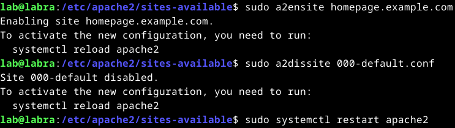

Vaihdoin käyttäjälle erkki komennolla `$ su erkki`. Loin käyttäjälle public_html-kansion komennolla `$ mkdir public_html`. Tein sinne index.html-tiedoston komennolla `$ micro public_html/index.html`, ja kirjoitin sisällöksi lyhyen testin. Menin sivulle http://localhost/~erkki, ja sivustolle ei ollut lupaa mennä.

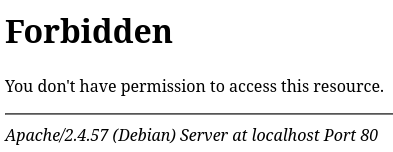

Selvittelin vikaa internetistä, ja löysin Apachen [Per-user web directories](https://httpd.apache.org/docs/2.4/howto/public_html.html)-manuaalista, että Userdir pitää ottaa käyttöön. Kirjauduin takaisin alkuperäiselle käyttäjälleni. Otin sen käyttöön komennolla `$ sudo a2enmod userdir`, ja käynnistin Apachen uudelleen `$ sudo systemctl restart apache2`. 

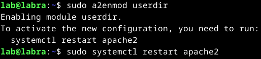

Huomasin vikaa selvitellessäni myös, ettei erkki-käyttäjän kotihakemistoon ole pääsyä muilla kuin erkillä. Korjasin tämän komennolla `$ sudo chmod go+rx erkki/`. 

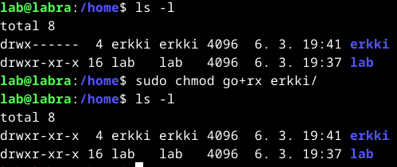

Tämän jälkeen kokeilin mennä uudestaan osoitteeseen http://localhost/~erkki/, ja tällä kertaa se palauttikin erkki-käyttäjällä tekemäni kotisivun. Tehtävä valmistui 20:00.

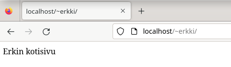

### SSH

Seuraavaksi tuli asentaa SSH-palvelin ja tehdä uusi testikäyttäjä. SSH-kirjautuminen tuli automatisoida avaimella ja lopuksi laittaa SSH-palvelin kuuntelemaan porttia 1337/tcp. (Tero Karvinen 2023.) Käytin tässä tehtävässä apuna Debianin [SSH-manuaalia](https://wiki.debian.org/SSH). Aloitin tehtävän tekemisen 20:20. Aloitin asentamalla SSH-palvelimen komennolla `$ sudo apt-get install openssh-server`. Tein myös testikäyttäjän komennolla `$ adduser testi`. 

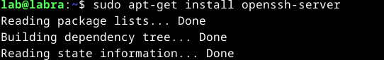 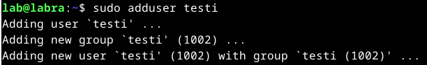

Kokeilin kirjautumista testi-käyttäjälle komennolla `$ ssh testi@localhost`, ja salasanan syöttämisen jälkeen pääsin sisään. 

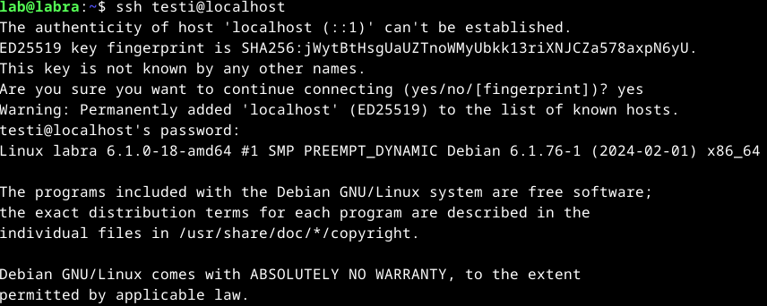

Poistuin SSH-yhteydestä takaisin alkuperäiselle käyttäjälleni komennolla `$ exit`. Loin SSH-avaimen komennolla `$ ssh-keygen`. Asetin avaimen tallentumaan oletuskansioon ja en asettanut salasanaa tässä testissä. Tämän jälkeen kopioin avaimen testikäyttäjälle komennolla `$ ssh-copy-id testi@localhost`. 

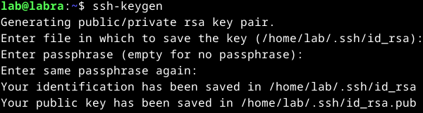 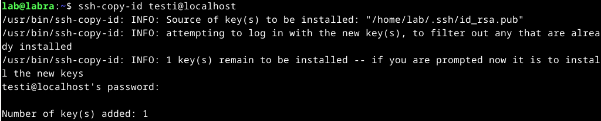

Kokeilin nyt muodostaa SSH-yhteyden uudestaan komennolla `$ ssh testi@localhost`, ja pääsin kirjautumaan suoraan sisään.

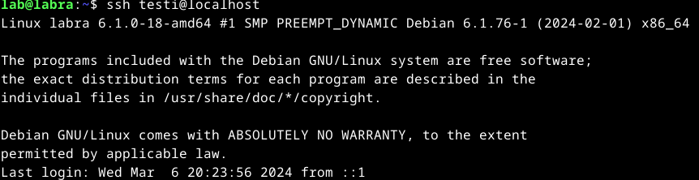

Seuraavaksi aloin vaihtamaan portin, jota SSH kuuntelee. Siirryin SSH-asetuskansioon komennolla `$ cd /etc/ssh/`. Muokkasin sshd_config-tiedostoa komennolla `$ sudoedit sshd_config`. Ja lisäsin siihen portin kuvan mukaisesti.

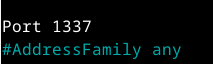

Tämän jälkeen käynnistin SSH-palvelimen uudestaan komennolla `$ sudo systemctl restart ssh`. Tämän jälkeen katsoin mitkä ohjelmat käyttää porttia 1337 komennolla `sudo lsof -i -P -n | grep LISTEN | grep 1337`, ja terminaali palautti, että se on SSH:n käytössä. Tehtävä oli valmis 21:00. 

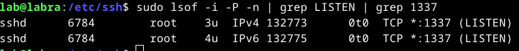

### Django

Tässä tehtävässä tuli asentaa Django, ja tehdä sinne tietokanta, jossa on lahjoitettuja esineitä. Tietokantaan piti pystyä kirjautumaan salasanalla, tehdä Erkille oma käyttäjä ja tehdä taulu Donations- joka sisältää lahjoitukset. (Tero Karvinen 2023.) Käytin tehtävässä ohjeena Tero Karvisen [Django 4 Instant Customer Database Tutorial](https://terokarvinen.com/2022/django-instant-crm-tutorial/) -artikkelia. Aloitin tehtävän teon 21:20. Aloitin tehtävän asentamalla virtualenvin komennolla `$ sudo apt-get -y install virtualenv`. Tämän jälkeen tein uuden kansion tehtävälle komennolla `$ mkdir django`, ja siirryin sinne. Loin uuden kansion ladattaville ohjelmille komennolla `$ virtualenv --system-site-packages -p python3 env/`, ja otin virtualenv-tilan käyttöön `$ source env/bin/activate`.

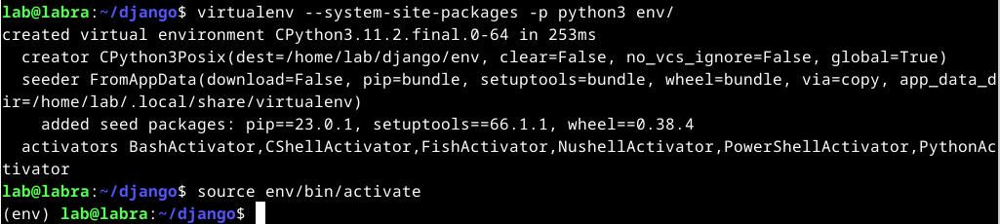

Loin requirements.txt-tiedoston komennolla `$ micro requirements.txt`, johon kirjoitin sisällöksi "django". Tämä vaihe tehtiin, ettei tekstiä vahingossa kirjoita asennusvaiheessa väärin. Tämän jälkeen asensin Djangon komennolla `$ pip install -r requirements.txt`.

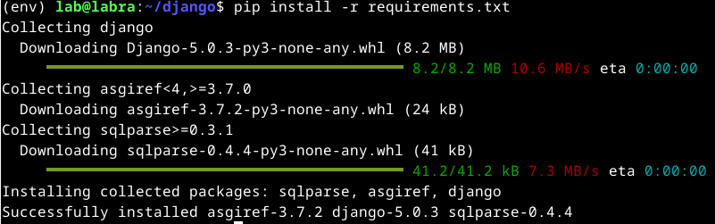

Aloitin uuden projektin komennolla `$ django-admin startproject donations`, ja siirryin juuri luotuun projektikansioon. Tämän jälkeen käynnistin testiserverin komennolla `$ ./manage.py runserver`. Menin terminaalin palauttamaan osoitteeseen, ja sain näkyville Djangon oletussivun. Punainen teksti terminaalissa kertoo, että tietokanta pitää päivittää.

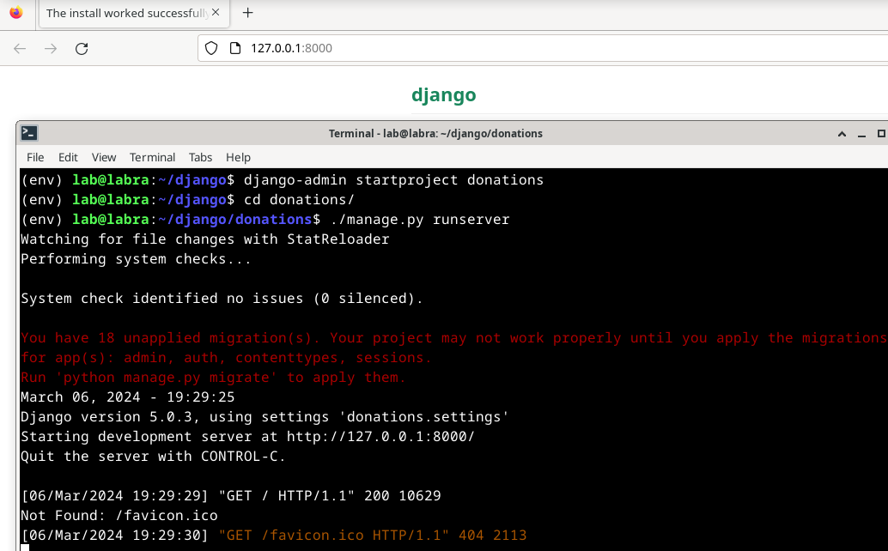

Tämän jälkeen päivitin tietokannat komennolla `$ ./manage.py makemigrations`, ja sen jälkeen `$ ./manage.py migrate`. Tämän jälkeen loin admin-käyttäjän komennolla `$ ./manage.py createsuperuser`. 

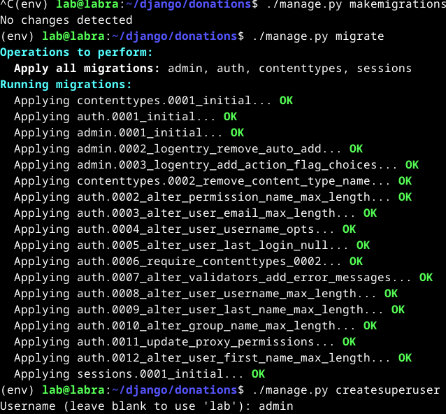

Loin osoitteessa http://127.0.0.1:8000/admin/ Erkille käyttäjän nimellä erkki, ja annoin hänelle staff-roolin.

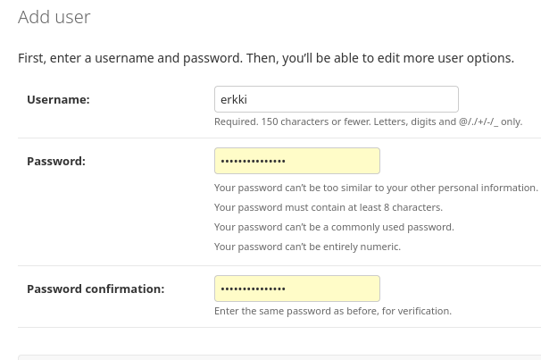 

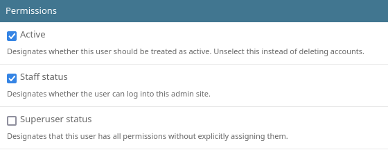

Tein uuden ohjelman komennolla `$ ./manage.py startapp donation`. Menin muokkaamaan projektin asetuksia komennolla `$ micro donations/settings.py`, ja lisäsin asetuksiin INSTALLED_APPS juuri luomani ohjelman nimen.

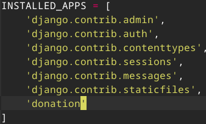

Tämän jälkeen muokkasin donation-ohjelman models.py-tiedostoa komennolla `$ micro donation/models.py`. Lisäsin sinne kuvanmukaisesti Item-luokan, jolla on attribuuttina nimi ja hinta. Viimeinen kappale määrittää sen, että tavarat näkyvät nimellään tietokannassa.

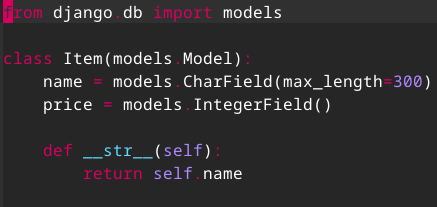

Tämän jälkeen päivitin tietokannat uudelleen komennolla `$ ./manage.py makemigrations`, ja sen jälkeen `$ ./manage.py migrate`. Tämän jälkeen vielä rekisteröin uuden tietokannan muokkaamalla admin.py-tiedostoa komennolla `$ micro donation/admin.py`. Lisäsin juuri luomani luokan sinne kuvan mukaisesti.

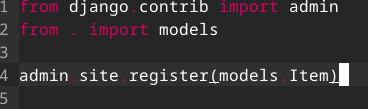

Käynnistin taas testiserverin komennolla `$ ./manage.py runserver`. Menin osoitteeseen http://127.0.0.1:8000/admin/, ja kokeilin lisätä ja poistaa esineitä. Annoin erkki-käyttäjälle luvan katsoa Item-luokan esineitä. Kirjauduttuani erkki-käyttäjälle näin esineet, mutta en voinut muokata niitä, eli sovellus toimi haluamallani tavalla. Tehtävä oli valmis 22:00.

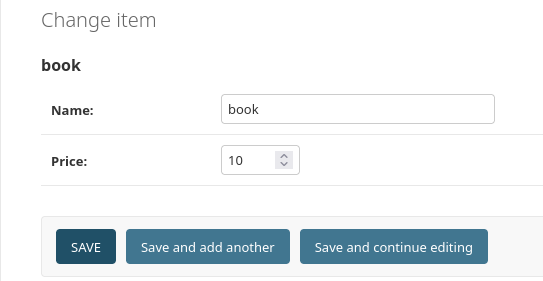

### Tuotantotyyppinen Django

Viimeisenä tuli tehdä tuotantotyyppinen asennus Djangosta, ja asettaa siihen edellinen lahjatietokanta (Karvinen 2023). Käytin tehtävässä ohjeena Tero Karvisen [Deploy Django 4 - Production Install](https://terokarvinen.com/2022/deploy-django/) -artikkelia. Aloitin tehtävän tekemisen 22:30. Tein ensin uuden hakemiston komennolla `$ mkdir publicwsgi`, ja siirryin hakemiston sisään. Siirryin virtualenv-tilaan juuri samalla tavalla, kuin ylemmässä tehtävässä. Kopioin edellisessä tehtävässä tekemäni requirements.txt-tiedoston komennolla `$ cp /home/lab/django/requirements.txt requirements.txt`. Asensin Djangon komennolla `$ pip install -r requirements.txt`.

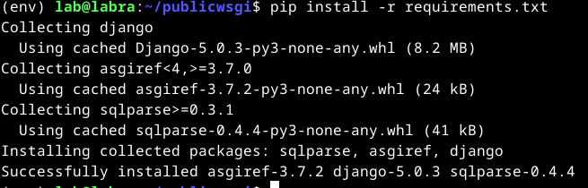

Aloitin uuden Django-projektin komennolla `$ django-admin startproject production`. Loin projektille Apache-asetustiedoston komennolla `$ sudoedit /etc/apache2/sites-available/production.conf`. Kirjoitin tiedoston sisällön kuvan mukaisesti.

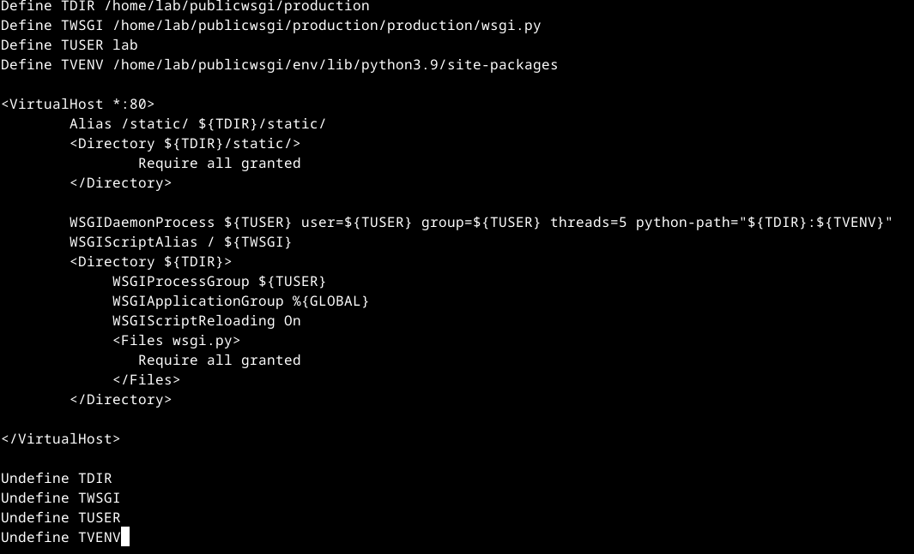

Asensin WSGI-moduulin komennolla `$ sudo apt-get -y install libapache2-mod-wsgi-py3`. Otin sivun käyttöön komennolla `$ sudo a2ensite production.conf`, ja otin vanhan pois käytöstä `$ sudo a2dissite homepage.example.com`. Käynnistin Apachen uudestaan komennolla `$ sudo systemctl restart apache2`. Kokeilin mennä http://localhost/ -osoitteeseen ja sivu ei toiminut. 

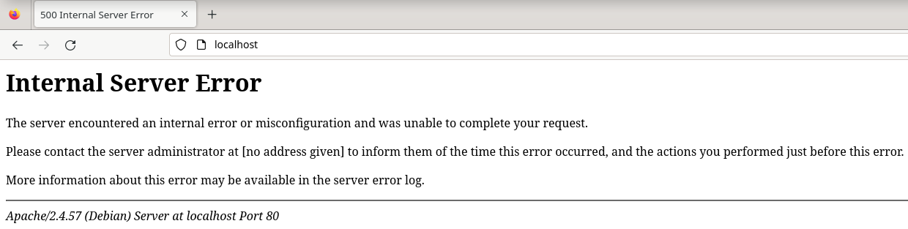

Menin katsomaan error.logia komennolla `$ sudo tail /var/log/apache2/error.log`, ja vastauksista päätellen Djangoa ei löytynyt.

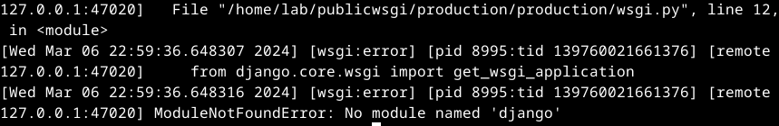

Huomasin kirjoitusvirheen production.conf-tiedostossa TVENV-kohdassa, joka ei näkynyt config-testissä. Kirjoitusvirheen takia Python-paketteja etsittiin väärästä kansiosta. Korjasin sen komennolla `$ sudoedit /etc/apache2/sites-available/production.conf`. Käynnistin Apachen uudestaan komennolla `$ sudo systemctl restart apache2`.

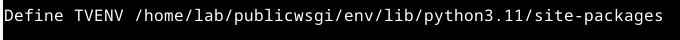

Nyt http://localhost/-osoitteesta avautui Djangon oletussivu. Tarkistin vielä `$ curl -sI localhost|grep Server`, että pyyntöön vastaa Apache.

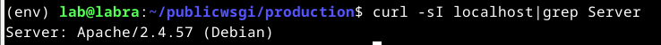

Tämän jälkeen muokkasin settings.py-tiedostoa komennolla `$ micro production/settings.py `, ottaakseni debugin pois päältä. Lisäsin siihen sallituksi osoitteeksi localhostin kuvan mukaisesti.

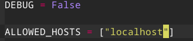

Tämän jälkeen päivitin muutokset komennolla `$ touch production/wsgi.py`. Etusivulla ei näkynyt mitään, koska sille ei olla määritelty sisältöä. Osoitteesta http://localhost/admin/login/ avautui muotoilematon kirjautumissivu.

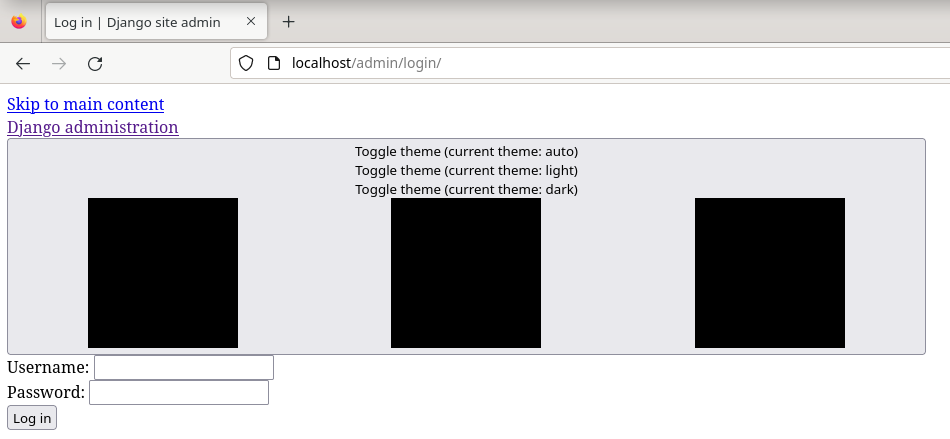

Seuraavaksi aloin kopioimaan edellisessä tehtävässä tekemääni sovellusta. Kopioin koko sovelluksen komennolla `$ cp -r /home/lab/django/donations/donation donation` nykyiseen projektikansiooni. Muokkasin settings.py INSTALLED_APPS-kohtaa ja lisäsin taas kuvan mukaisesti donation-ohjelman. 

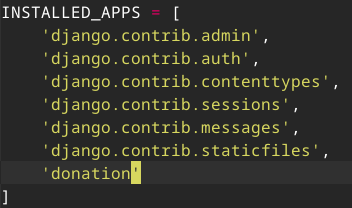

Poistin donation-ohjelman kansiosta migrations-kansion siltä varalta että se sisältää viittauksia edelliseen projektiin komennolla `$ rm -r migrations/`. Tein vielä admin-käyttäjän komennolla `$ $ ./manage.py createsuperuser`.

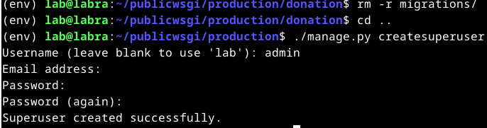

Importoin muotoilun sivustolle, koska sitä oli ärsyttävä käyttää ilman muotoiluja. Tein sen muokkaamalla settings.py-tiedostoa komennolla `$ micro production/settings.py`, ja lisäämällä tiedostoon:

    import os
    STATIC_ROOT = os.path.join(BASE_DIR, 'static/')

Tämän jälkeen kopioin tiedostot `$ ./manage.py collectstatic`. Nyt sivulla näkyi muotoilu.

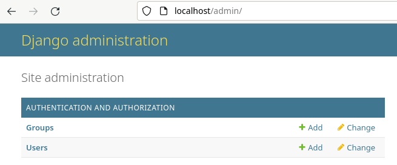

Yritin päivittää tiedot normaalisti komennolla `$ ./manage.py makemigrations`, ja sen jälkeen `$ ./manage.py migrate`. Tämä ei kuitenkaan löytänyt donation-ohjelmaa, mutta päivittäessäni komennolla `$ python ./manage.py makemigrations donation` se löytyi (luultavasti pythonia ei olisi tarvinnut lisätä komennon alkuun). Jatkoin normaalisti tekemällä komennon `$ ./manage.py migrate`. 

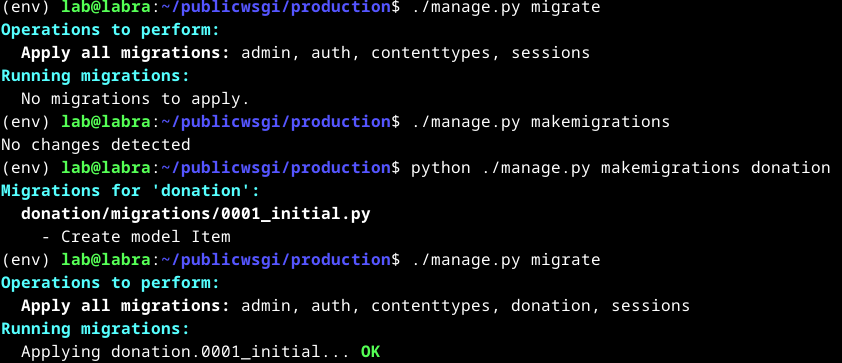

Käynnistin Apachen uudelleen komennolla `$ sudo systemctl restart apache2`. Nyt http://localhost/admin/-osoitteessa näkyi tekemäni donation-ohjelma. Tehtävä oli valmis 00:00.

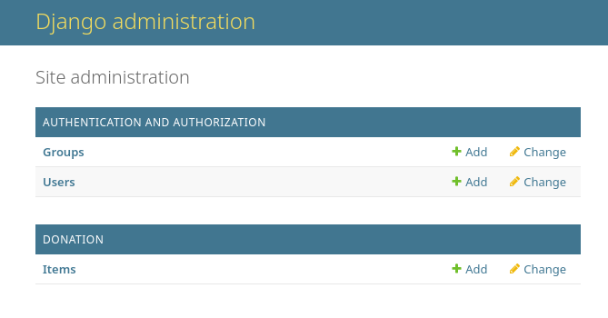

## Uuden virtuaalikoneen teko arvioitavaa laboratorioharjoitusta varten

Tein laboratorioharjoitus-nimisen virtuaalikoneen loppuharjoitusta varten. Asetin sille Debian live-levykuvan.

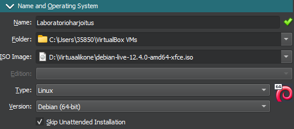

Annoin koneelle 4 GB ram-muistia ja 4 prosessorinydintä.

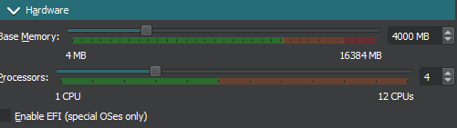

Loin uuden kovalevyn ja annoin sille muistia 60 GB. Jätin automaattisen allokoinnin pois päältä. 

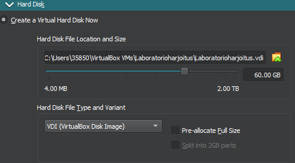

Loin tietokoneen painamalla `Finish`-nappia. Asensin Debian 12 Bookworm -käyttöjärjestelmän kuvanmukaisilla asetuksilla.

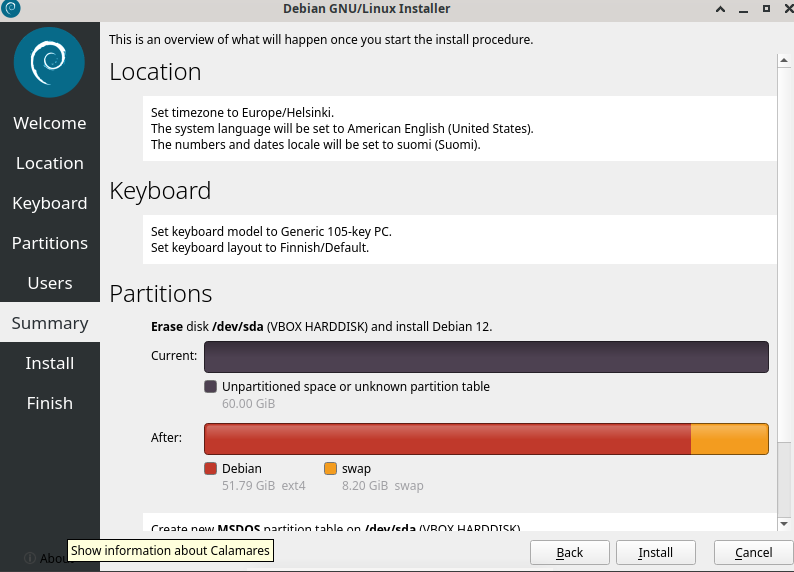

Viimeiseksi vielä ajoin päivitykset komennolla `$ sudo apt-get update` ja sen jälkeen `$ sudo apt-get -y dist-upgrade`. Päivitysten valmistuttua asensin palomuurin komennolla `$ sudo apt-get -y install ufw` ja otin sen käyttöön komennolla `$ sudo ufw enable`. Nyt virtuaalikone olikinsud valmis laboratorioharjoitusta varten.

# Lähteet

Apache Software Foundation. s.a. Per-user web directories. Apache Software Foundation. Luettavissa: [https://httpd.apache.org/docs/2.4/howto/public_html.html](https://httpd.apache.org/docs/2.4/howto/public_html.html). Luettu: 06.03.2024.

Debian Wiki. 09.11.2023. SSH. Debian Wiki. Luettavissa: [https://wiki.debian.org/SSH](https://wiki.debian.org/SSH). Luettu: 06.03.2024.

Karvinen, T. 2021. Django 4 Instant Customer Database Tutorial. Tero Karvisen verkkosivusto. Luettavissa: [https://terokarvinen.com/2022/django-instant-crm-tutorial/](https://terokarvinen.com/2022/django-instant-crm-tutorial/). Luettu: 06.03.2024.

Karvinen, T. 2021. Deploy Django 4 - Production Install. Tero Karvisen verkkosivusto. Luettavissa: [https://terokarvinen.com/2022/deploy-django/](https://terokarvinen.com/2022/deploy-django/). Luettu: 06.03.2024.

Karvinen, T. 2023. Final Lab for Linux Palvelimet 2023. Tero Karvisen verkkosivusto. Luettavissa: [https://terokarvinen.com/2023/linux-palvelimet-2023-arvioitava-laboratorioharjoitus/](https://terokarvinen.com/2023/linux-palvelimet-2023-arvioitava-laboratorioharjoitus/). Luettu: 05.03.2024.

Karvinen, T. 27.09.2018. Hello World Python3, Bash, C, C++, Go, Lua, Ruby, Java – Programming Languages on Ubuntu 18.04. Tero Karvisen verkkosivusto. Luettavissa: [https://terokarvinen.com/2018/hello-python3-bash-c-c-go-lua-ruby-java-programming-languages-on-ubuntu-18-04/?fromSearch=hello%20world](https://terokarvinen.com/2018/hello-python3-bash-c-c-go-lua-ruby-java-programming-languages-on-ubuntu-18-04/?fromSearch=hello%20world). Luettu: 05.03.2024.

Karvinen, T. 2024. Linux Palvelimet 2024 alkukevät. Tehtävänanto H7 Maalisuora. Tero Karvisen verkkosivusto. Luettavissa: [https://terokarvinen.com/2024/linux-palvelimet-2024-alkukevat/](https://terokarvinen.com/2024/linux-palvelimet-2024-alkukevat/). Luettu: 05.03.2024.

Karvinen, T. s.a. micro-jump - Jump to function. Github. Luettavissa: [https://github.com/terokarvinen/micro-jump](https://github.com/terokarvinen/micro-jump). Luettu: 06.03.2024.

Karvinen, T. 10.04.2018. Name Based Virtual Hosts on Apache – Multiple Websites to Single IP Address. Tero Karvisen verkkosivusto. Luettavissa: [https://terokarvinen.com/2018/name-based-virtual-hosts-on-apache-multiple-websites-to-single-ip-address/?fromSearch=apache](https://terokarvinen.com/2018/name-based-virtual-hosts-on-apache-multiple-websites-to-single-ip-address/?fromSearch=apache). Luettu: 06.03.2024.

Karvinen, T. 04.12.2007. Shell Scripting. Tero Karvisen verkkosivusto. Luettavissa: [https://terokarvinen.com/2007/shell-scripting-4/#see_also](https://terokarvinen.com/2007/shell-scripting-4/#see_also). Luettu: 05.03.2024.
